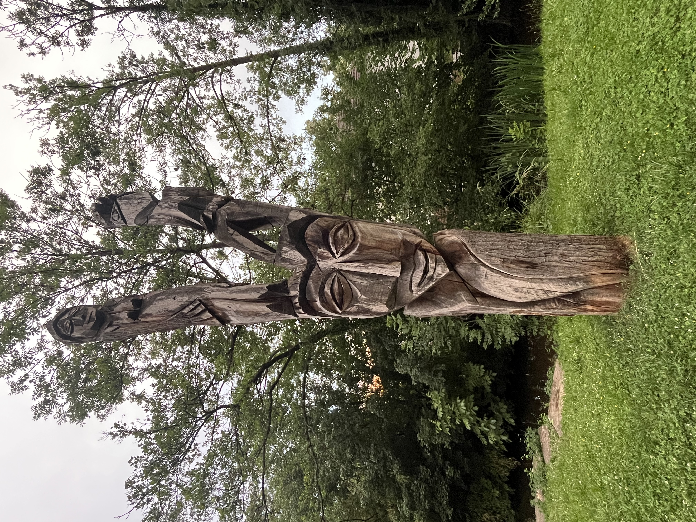
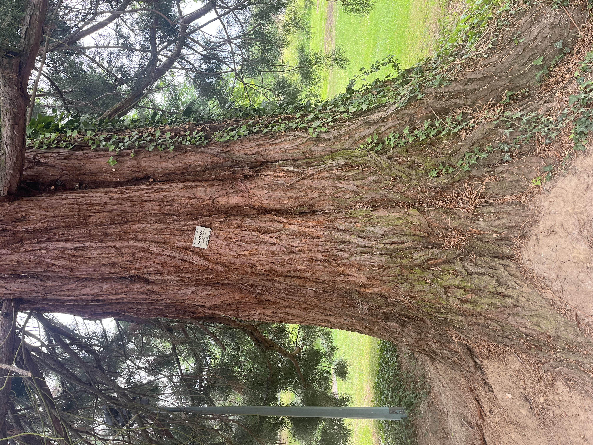
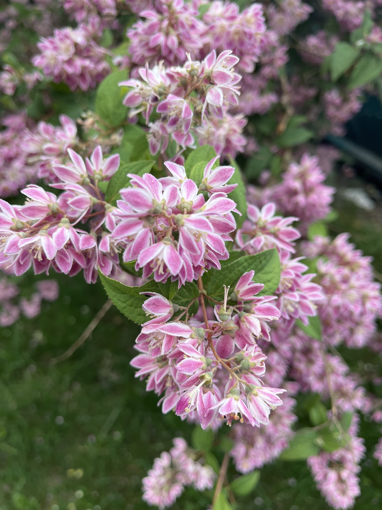
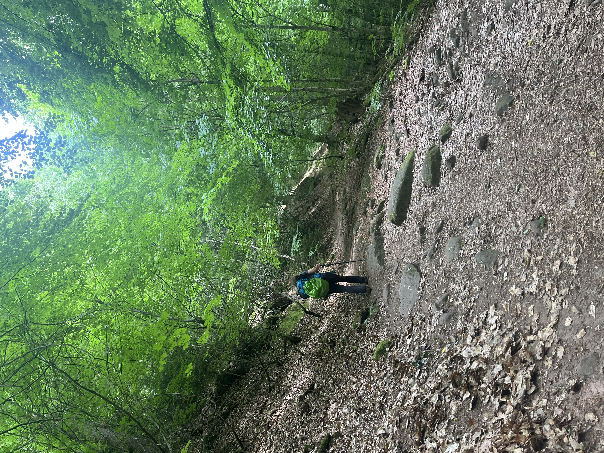
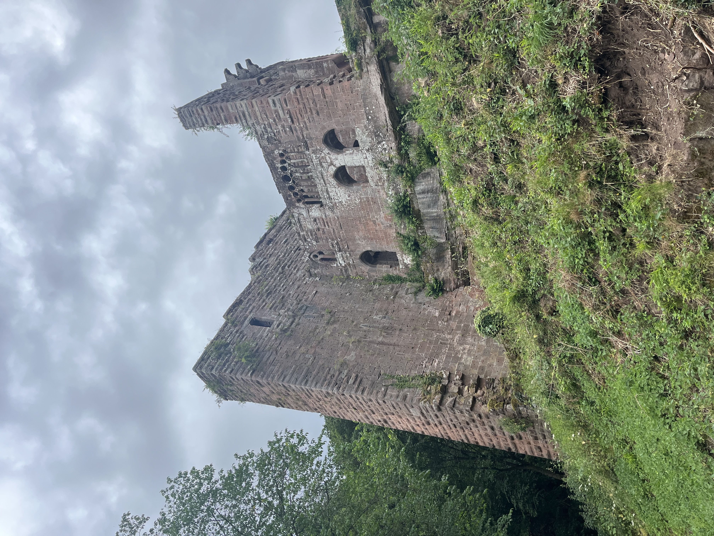
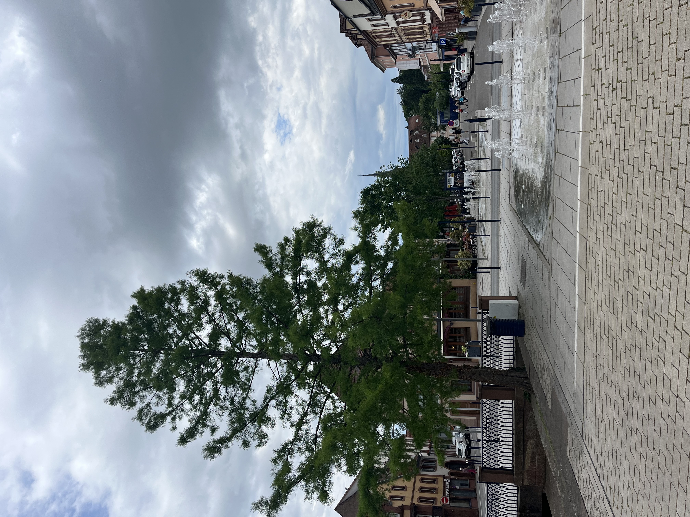

    ---
title: "Terug wandelen"
date: 2026-06-02
draft: false

---
Onze benen pikken serieus van gisteren. We zijn wel gewoon van te wandelen maar niet omhoog en naar beneden in ons vlakke landje. We wagen het er toch op om een tocht te ondernemen naar de ruïne van het Wasenbourg kasteel.
Wat ons opvalt, zowel in Reichshoffen als in Niederbronn-Les-Bains, zijn de prachtige parken. In Reichshoffen is er een mooi park langs de rivier met indrukwekkende sculpturen.

In Niederbronn-Les-Bains staan er meerdere mammoetbomen, volgens het plaatje op de boom geschat op 155 jaar. Onmogelijk om deze helemaal op de foto te zetten wegens veel te groot!

We genieten van de pracht van de bomen en bloemen onderweg naar het onvermijdelijke weer terug naar omhoog!

Het lukt toch om de ruïne van het kasteel te bereiken.

En wat zijn we blij als we terug beneden zijn!

