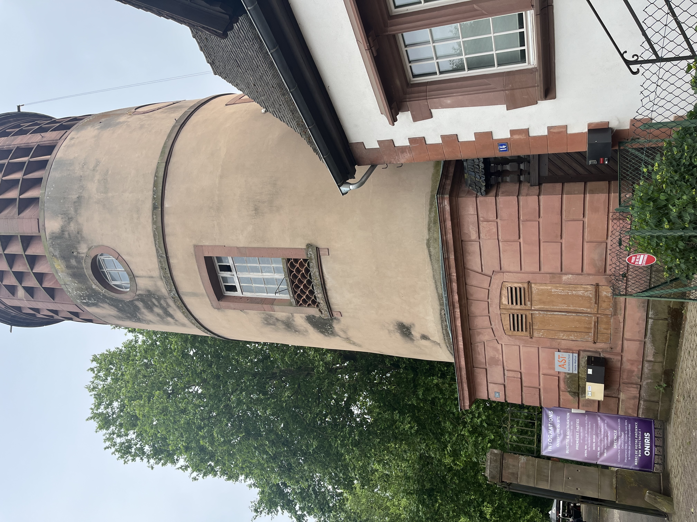
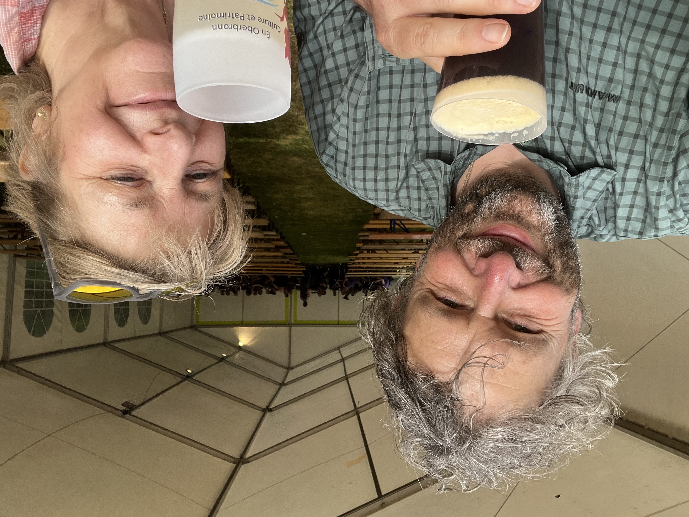
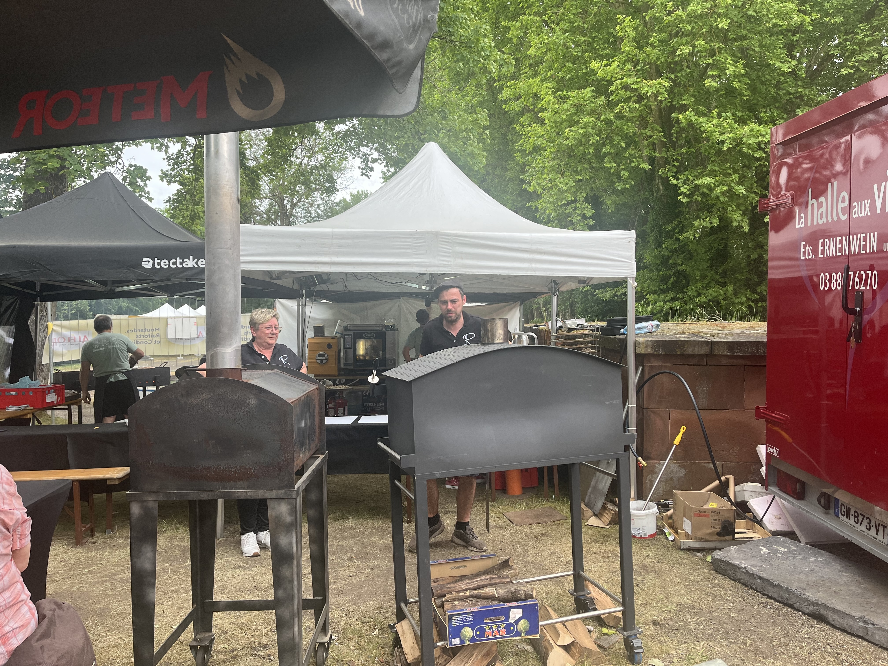
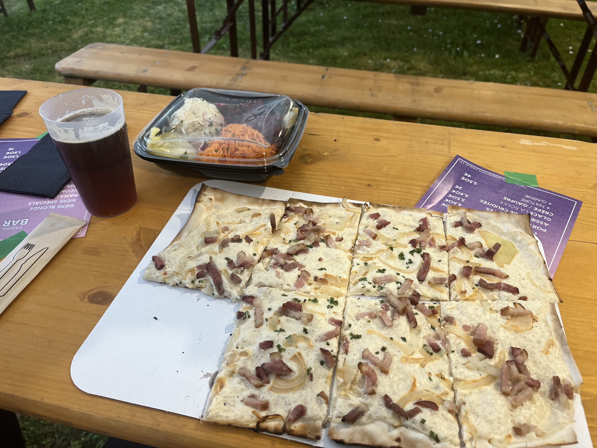

En weg zijn we. Maar we doen nog 2 tussenstops voor Zwitserland. We houden eerst halt in de Vogezen. In Reichshoffen, wij Vlamingen zouden dat uitspreken op zijn Duits, maar onze host spreekt het uit op zijn Frans  'Rei-ch-hof-fen'.
Eens geïnstalleerd in ons appartement verkennen we de stad. Het is een 5-tal minuten wandelen langs een riviertje tot het centrum. Onze host had al gezegd dat dit deel van Frankrijk een rijke geschiedenis had in staal en locomotiefbouw. Al vlug ontdekken we in het stadje een groot kasteel in een park 'De Dietrich', met een imposante toren.

De Dietrich is een grote familie die al vanaf de 16de eeuw bezig was in de industrie.
En we komen goed gelegen want er is 3 dagen een spectacle in een arena achter het kasteel.
Met voorprogramma, om 18u begint de eerste harmonie met hun concert. Zie je ze klaarzitten achter ons? 

In plaats van bier serveren ze hier picon-bière. Lekker maar wel straffe toebak. Woeha!
En we hebben natuurlijk ook een hongertje. Dat treft! Er staat een stand waar ze houtgestookte tarte flambée klaarmaken.

Een tarte flambée met de plaatselijk kaas 'Raifort' en een fris slaatje gaat er altijd in hmmm.
 
