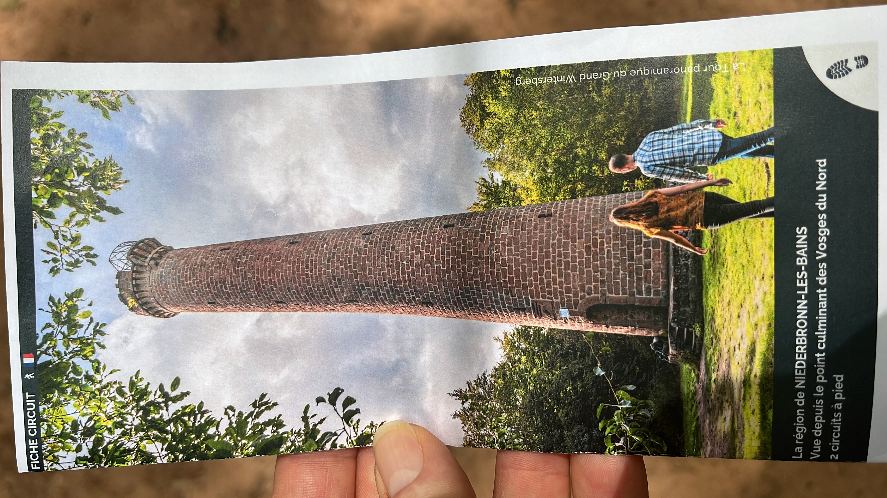
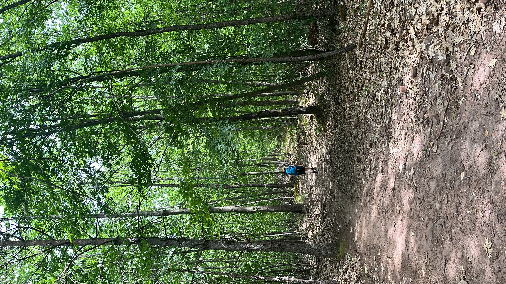
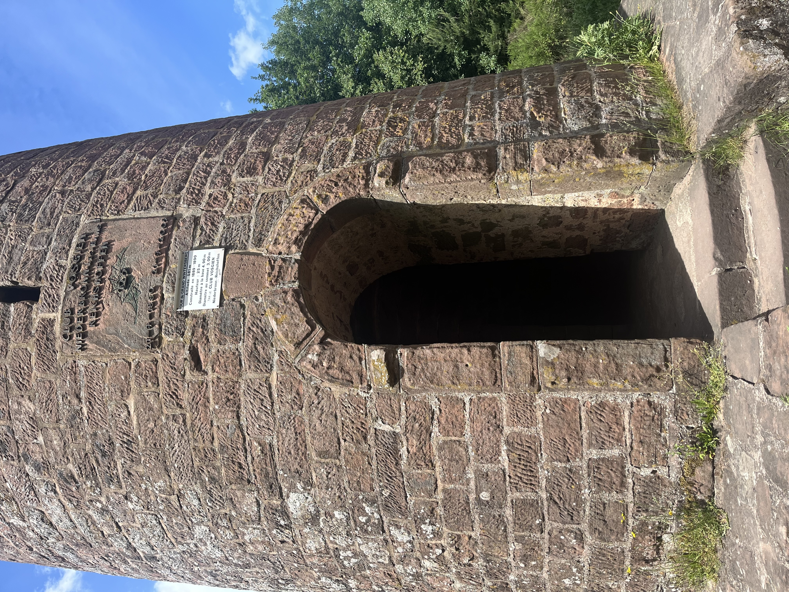
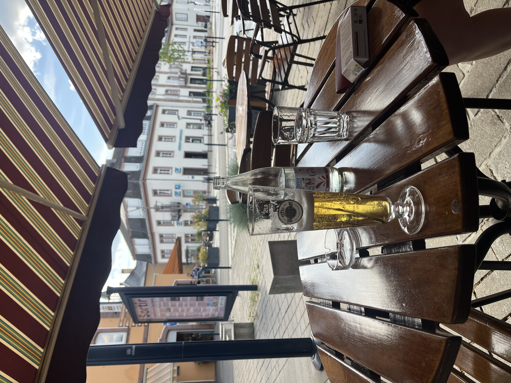

    ---
title: "Wandelen naar de toren op de berg"
date: 2026-06-01
draft: false

---
Vandaag is het wandeldag. Wel redelijk warm en zonnig, maar we hopen de grote warmte te ontwijken door een tocht in de bossen richting een hoge toren.

Deze toren is gebouwd in 1890 door de 'Club Vosgien'. Heel bekend in de Vogezen, deze wandelvereniging bestaat dus al zo lang en is beroemd door hun uitstekend aangegeven wandelwegen (met gekleurde symbolen) en gedetailleerde kaarten.
Het is een mooi pad door de bossen omhoog, maar door de warmte (zelfs in de schaduw) doen we het kalm aan. Zeker omdat we weten dat ons vandaag bijna 500 hoogtemeters staan te wachten.

Het lukt ons dan toch om tot aan de toren te geraken.

Gery klimt de 25 meter tot boven en het uitzicht op de top is spectaculair. Dit is het hoogste punt hier in de omgeving.
Het afdalen is zoals gewoonlijk moeilijker als naar boven, dus uiteindelijk hebben we toch meer dan 4 uur gewandeld vooraleer we terug beneden in de stad aankomen.

Misschien morgen terug een wandeling, als onze benen het nog aankunnen.
