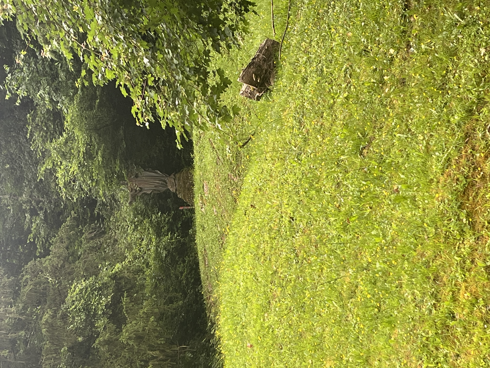
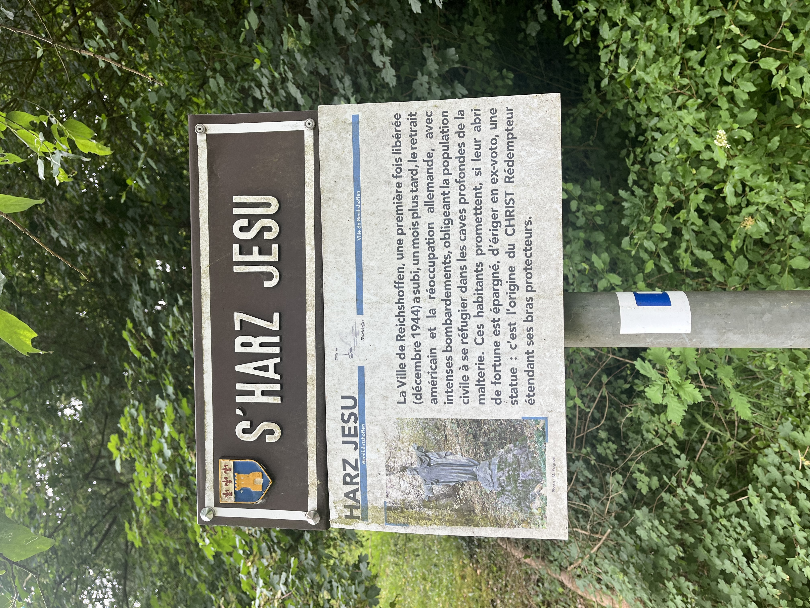
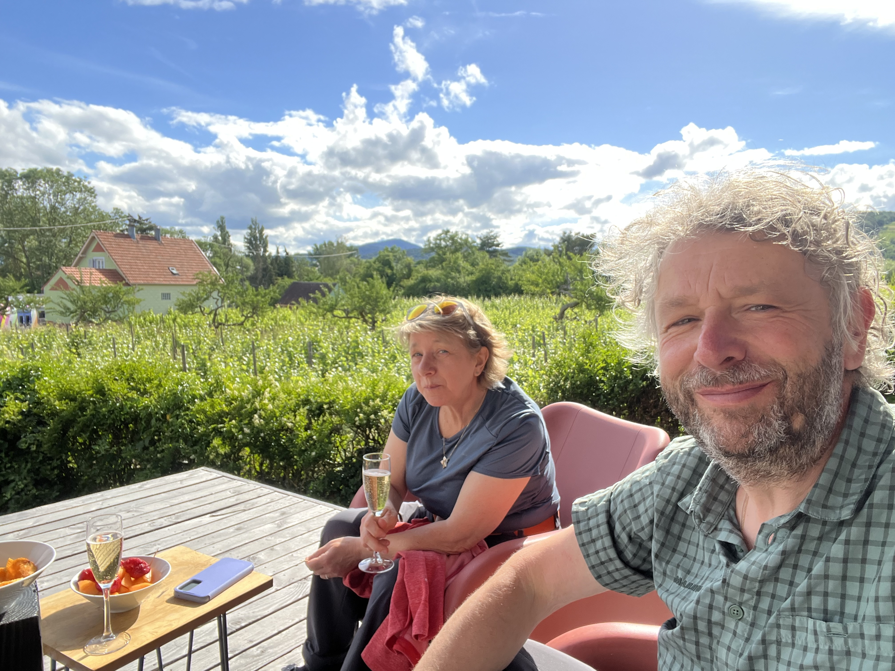

    ---
title: "Elzas"
date: 2026-06-03
draft: false

---
We zijn verhuisd, naar de Elzas. In het Frans klinkt dat toch veel beter, hé, ''Alsace''. Dat blijft bij Gery toch één van zijn favoriete Franse streken. Later meer.
Voor we vertrokken, hebben we nog een wandeling gedaan bij het plan d'eau van Reichshoffen. Dit bestaat sinds 1982 en is eigenlijk een afdamming van een rivier. Er staat ook een vogelkijkhut, maar daar was niets speciaals te horen of te zien.
Onderweg stond er een 'Jezus' met uitleg. Blijkbaar zijn de inwoners van Reichshoffen 2 keer bevrijd in 1945. Nadat de Amerikanen zich hadden teruggetrokken, zijn de Duitsers na een maand teruggekomen en hebben ze intense bombardementen uitgevoerd. De burgers beloofden om een standbeeld ter ere van Jezus op te richten, mochten ze dit overleven.

In deze streek vind je veel over de oorlogen die de mensen ooit hebben uitgevochten. Als je de rivier volgt naar het centrum, vind je op een hoek een graf van 2 Zoaven. Dat zijn Afrikaanse strijders die nog hebben meegevochten in de Frans-Duitse oorlog van 1870. Wanneer gaan die oorlogen ooit stoppen? 

In ieder geval zitten we nu in de Alsace. Ons terras kijkt uit op de wijngaarden van Gertwiller. Leuk toch!

Gery vindt deze streek de max om te komen. Lekkere witte wijntjes, gemoedelijke sfeer, vriendelijke mensen en lekkere gerechten. Wat wil je nog meer!
