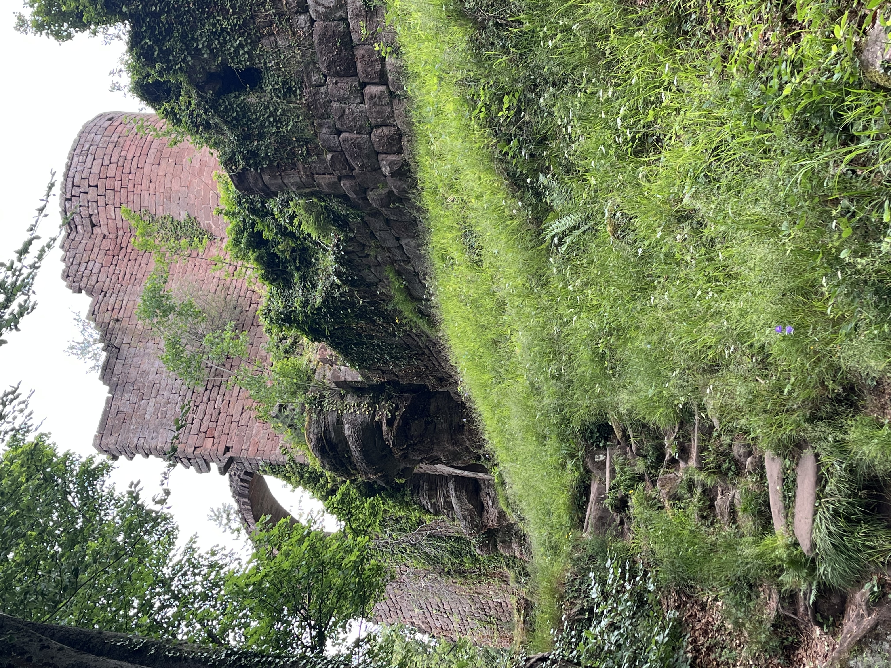
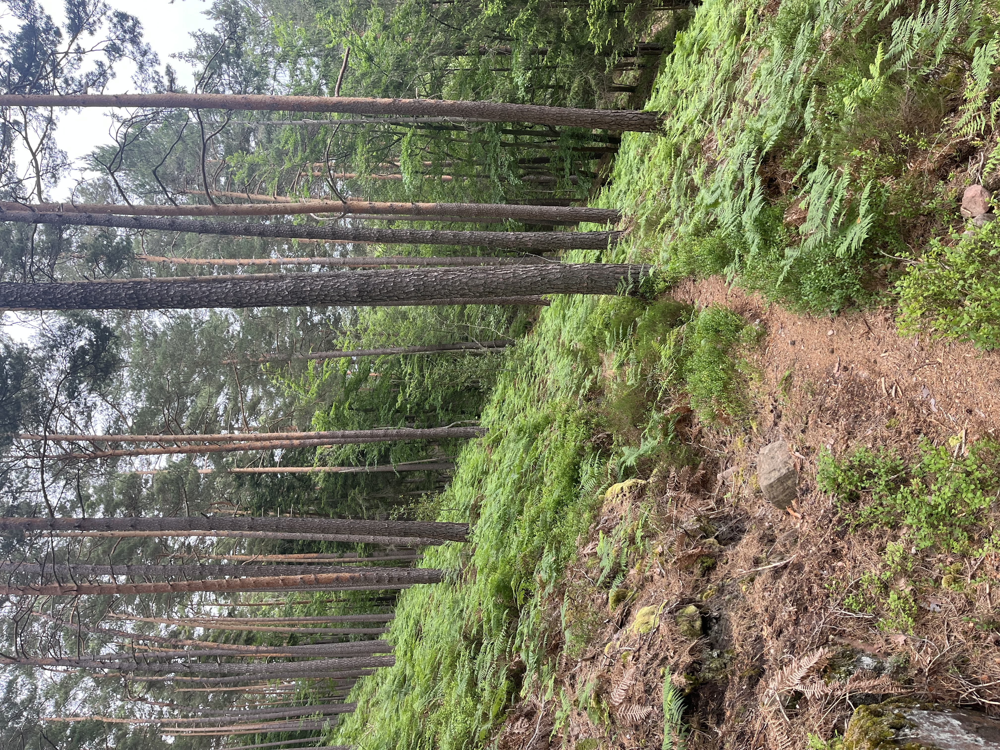
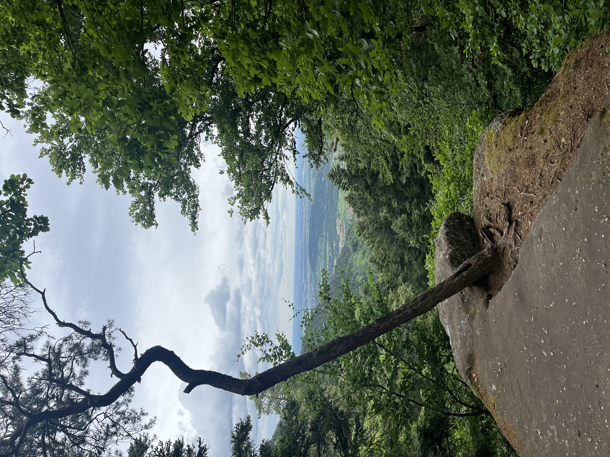
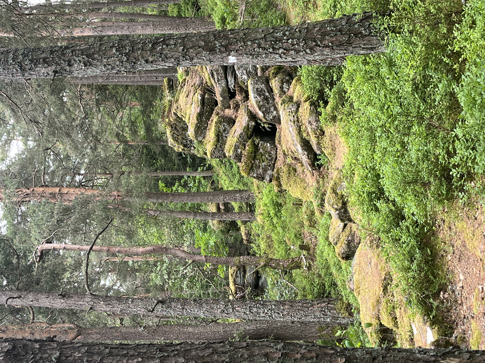
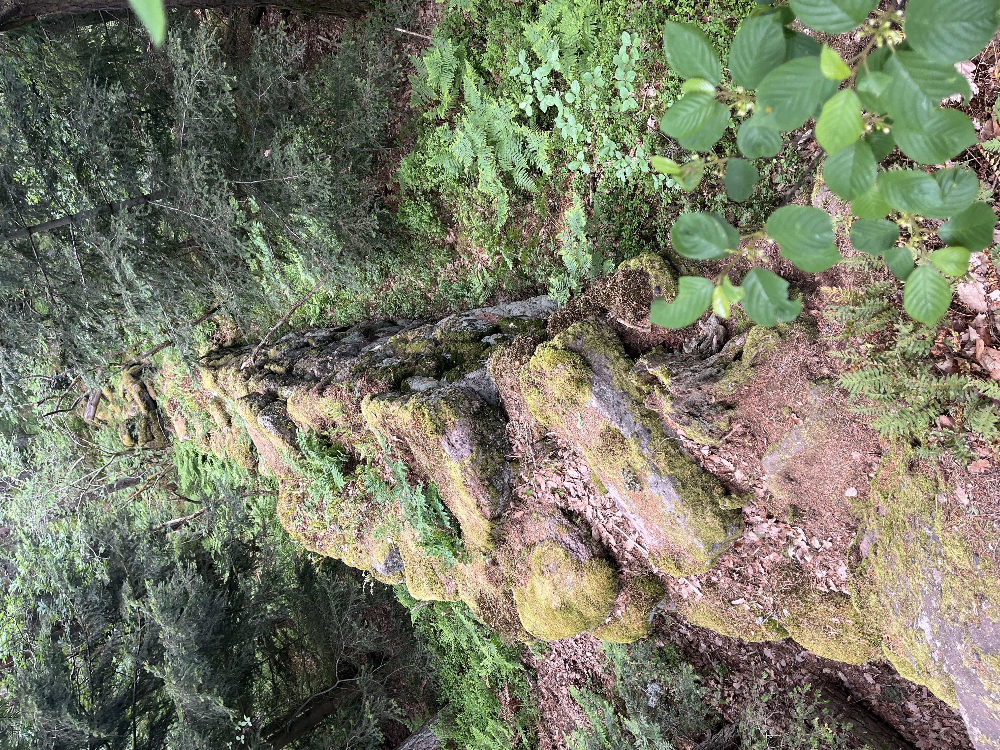
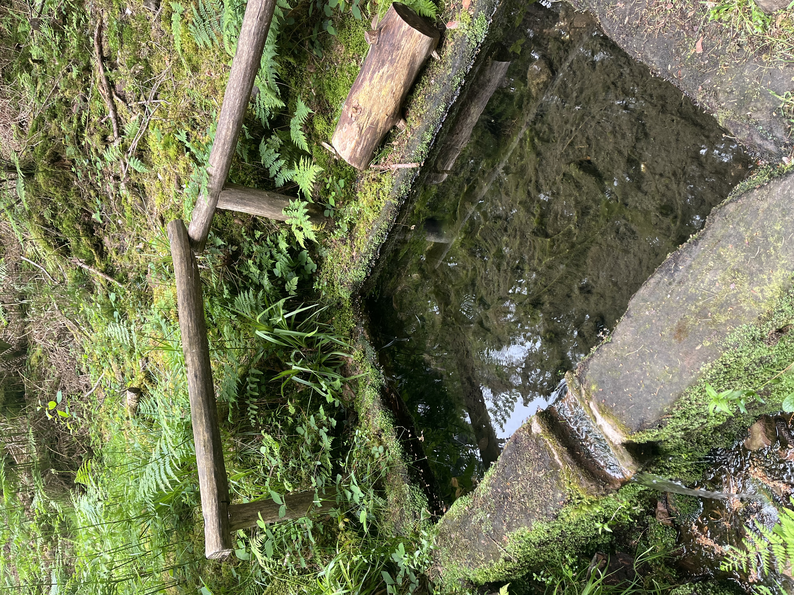

    ---
title: "Mur païen "
date: 2026-06-04
draft: false

---
Vandaag gaan we onze benen nog eens testen en plannen we een 'pelgrimstocht' naar de Mont Sainte-Odile. Daar staat een grote abdij op een rots voor Saint Odile die 1300 jaar geleden heeft geleefd en de patroonheilige is van de Elzas.
Dus weer bergop wandelen. Ongeveer halverwege passeren we aan de ruïne van kasteel Dreistein. Dit kasteel is eigenlijk gebouwd met stenen van de 'mur Païen' die van de berg naar beneden zijn gerold. Later daarover meer.

Voor zover je kan genieten als je steil omhoog wandelt, zitten we toch weer in een mooie omgeving, varens in een bos het heeft wel wat.

Onderweg een mooi uitkijkpunt naar de dorpen in de valei. Natuurlijk is dit 'in het echt' veel spectaculairder dan op de foto :-)

We geraken uiteindelijk boven, waarvan we geen foto's hebben. De reden waarom is heel simpel. Dit is heel toeristisch en bijna iedereen rijdt met de auto tot boven en zet zich op de parking vlakbij. Wij komen tenminste al wandelend!

Onderweg naar boven en beneden passeren we regelmatig overblijfselen van de 'mur Païen'.

Deze muur waarvan men, tot op heden, geen enkel idee heeft waarom deze is gebouwd, zou dateren uit het jaar 700. Deze muur loopt 11 km rond de berg met een breedte van 1,6 meter en op sommige plaatsen 3 meter hoog en zou gebouwd zijn met 300000 steenblokken. Ongelofelijk als je erover nadenkt!

Op de weg naar beneden maken we nog een ommetje langs de source 'Badstube' een bron met ongelofelijk helder water.

