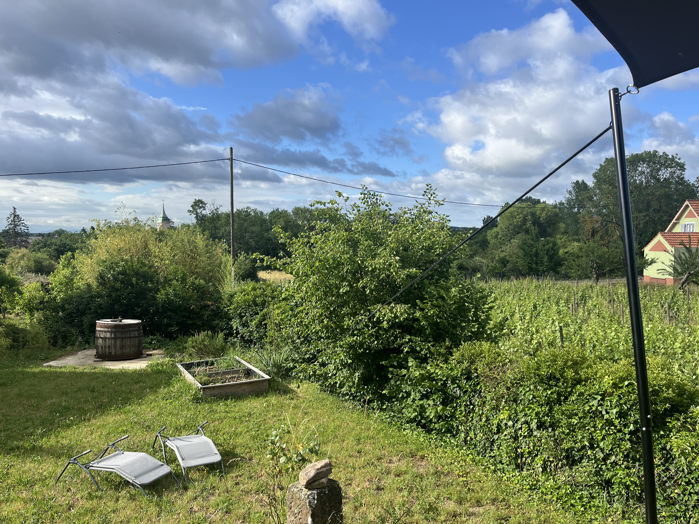

    ---
title: "Op naar Zwitserland!"
date: 2026-06-05
draft: false

---
Vandaag vertrekken we na het ontbijt richting Zwitserland. We hadden een uitnodiging van familie om eens langs te komen en die laten we natuurlijk niet liggen :-)  
Deze morgen bij het ontbijt op het terras weer een nieuwe vogelsoort erbij: de wielewaal. Die zit zijn typisch gefluit uit te oefenen. Als je kijkt op de foto, ergens in het bosje tussen de kerk en het huisje met het rode dak.

Dat wordt uiteindelijk een indrukwekkend lijstje van wat we daar allemaal gezien en gehoord hebben. In het tuintje zelf zaten constant meneer en mevrouw zwarte roodstaart (die je goed uit elkaar kan herkennen) insecten te vangen voor hun jongen die ergens in het nest zaten in het huis links van ons. Verder ook nog op de lijst. Merel, Geelgors, Cirlgors, Roodborst, Putter, Kneu, Vink, Groenling, Winterkoning en Nachtegaal. De ooievaar die een beetje verderop zijn nest had, kwam ook regelmatig voorbij zweven. Wat een weelde! Bij ons in Vlaanderen ondenkbaar. Gery heeft ooit meegedaan aan een inventarisatie van het Zammelsbroek in Geel om een nultelling te maken van de vogels voor de uitvoering van het Sigmaplan. Destijds, in 2009 en 2010, zaten er 8 koppels Wielewaal in het Zammelsbroek. De verantwoordelijke van Inbo, de instelling die het coördineerde, sprak van een bolwerk van Wielewaalen in Vlaanderen. Nu, 25 jaar later, hoor je al jaren geen wielewaal meer fluiten. Jammer toch!
