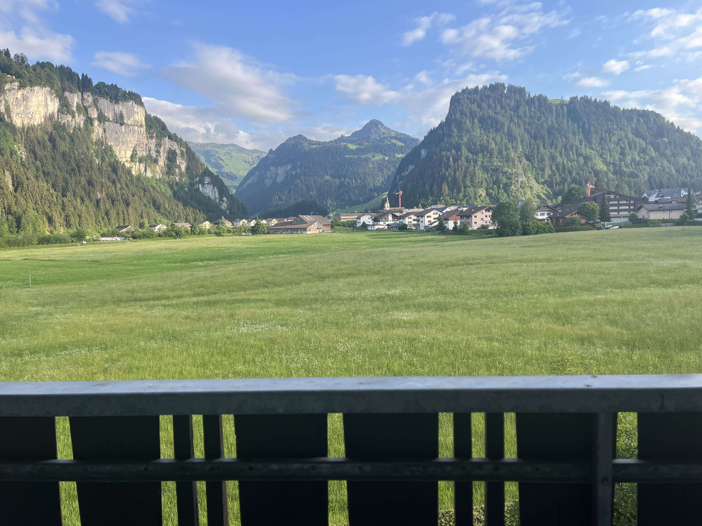
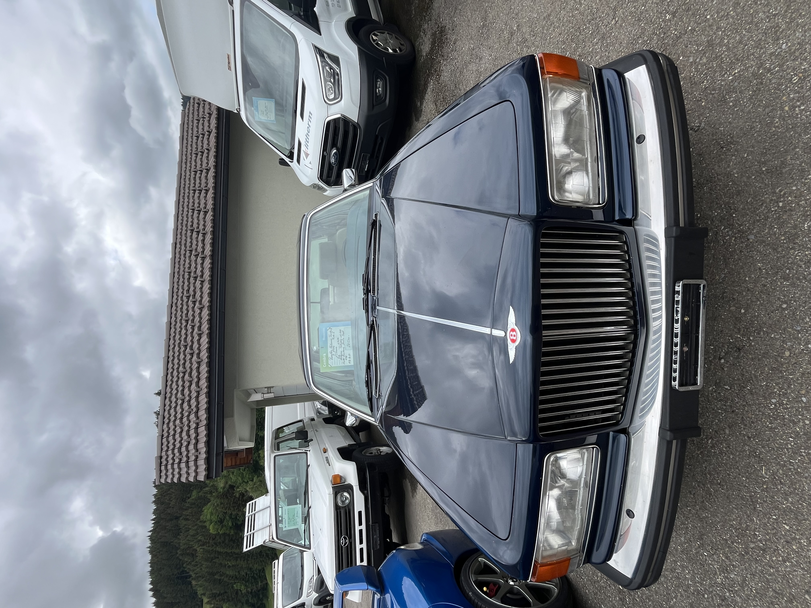
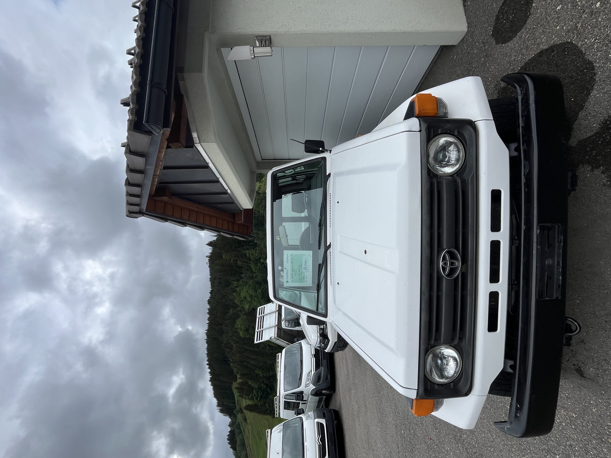
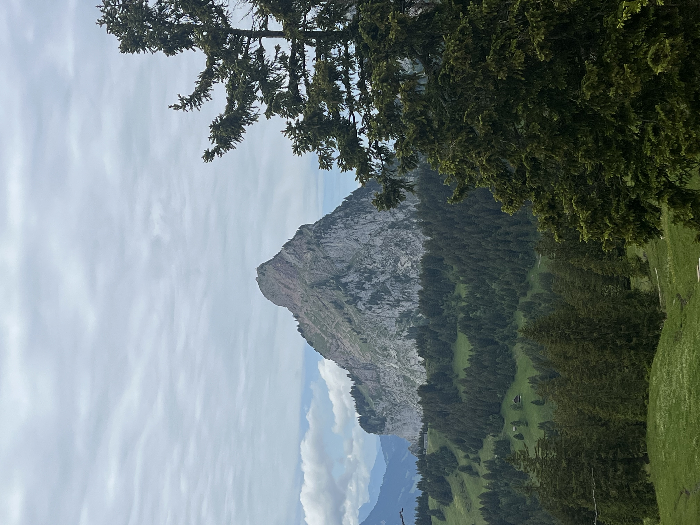
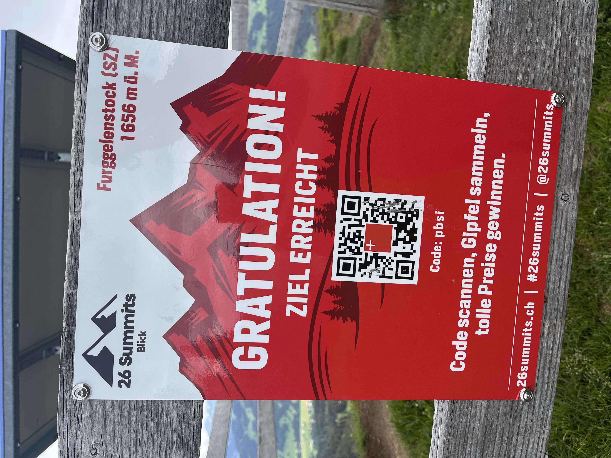
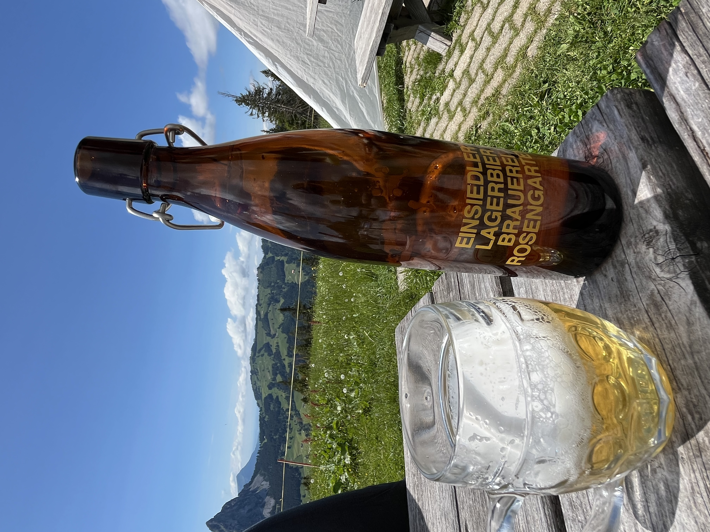

    ---
title: "Wanderland"
date: 2026-06-06
draft: false

---
Het zicht vanop ons balkon voor de volgende week, niet slecht hé. We verblijven in het laatste gebouw van de straat en hebben zicht op het dorp.

Gisteren zijn we ook nog het dorp gaan verkennen.  Wat onmiddellijk opvalt, is die netheid en ordelijkheid overal, toch anders dan in Frankrijk. We passeren een garage en daar staan heel wat opvallende auto's te koop. Wat dacht je van deze Bentley bijvoorbeeld? Trouwens, niet de enige; er stond nog een Bentley van 1960, prachtig exemplaar.

Wel bizar dat een Bentley met 137000 km op de teller voor 26500 CHF te koop staat en deze Toyota Land Cruiser met 225000 km exact evenveel moet kosten. 

 
Onze host heeft vandaag een wandeling voorzien die vertrekt vanuit het volgende dorp. Deze gaat door een naturschutzgebiet. Onderweg krijgen we zicht op de Grosser Mythen. Deze berg kan je beklimmen; boven op de top staat een hut waar je iets kan eten en drinken. Deze is enorm steil en sinds 1998 zijn er meer dan 20 dodelijke ongevallen geregistreerd, niet zozeer door extreem klimmen, maar door uitglijden, struikelen, vallen tijdens de afdaling, of het overschatten van het eigen kunnen. Vanop deze afstand zie je hoe steil de paden zijn. 

Na een stevige klim staan wij ook op het hoogste punt van onze wandeling.

Zalig gevoel toch, en zeker omdat we in het afdalen op de terugweg nog een boerderijtje/café passeren waar we het plaatselijke bier kunnen proeven.

Het was een heel afwisselende wandeling met mooie uitzichten, alpenweides, bos en moerassig gebied. Uiteindelijk hebben we bijna 5 uur gewandeld met bijna 600 hm, meer dan genoeg voor onze vlakke, gewoontebeentjes.
