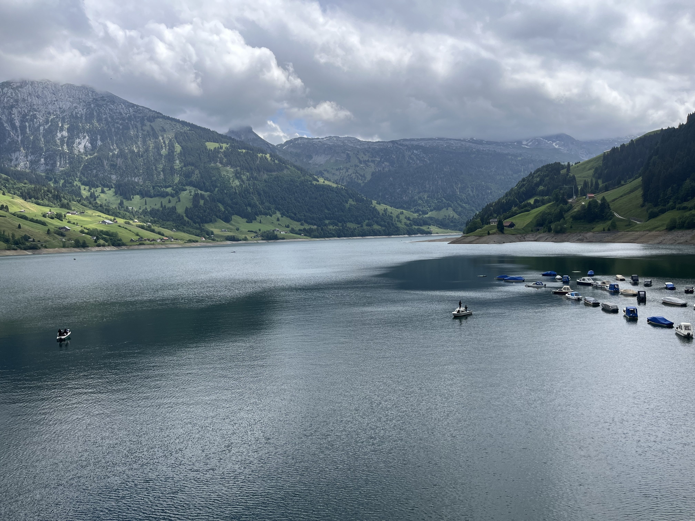
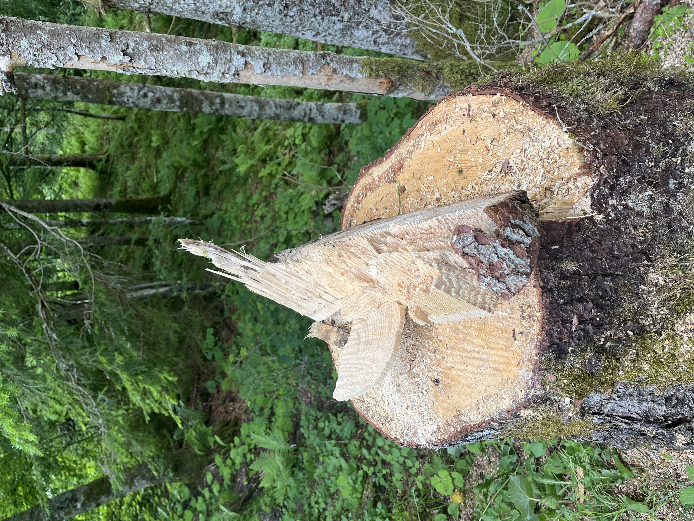
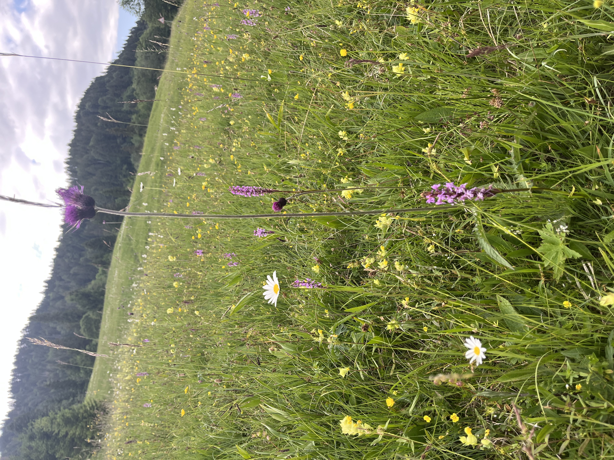

    ---
title: "Blauw"
date: 2026-06-07
draft: false

---
Vandaag besluiten we het iets kalmer aan te doen en een vlakkere wandeling te maken. Als we over een bergpas rijden, ligt aan de andere kant de Wäggitalersee. Dat is een stuwmeer, redelijk populair bij toeristen, want we zien veel nummerplaten van andere kantons in Zwitserland. 

Deze plaats is ook bekend bij vissers. Dat zie je ook aan de vele bootjes die er liggen, allemaal vissersbootjes. We gaan helemaal rond het meer wandelen. Als we het enige dorpje voorbij wandelen, zie je de vissers al gevangen forellen kuisen. Op 2 plaatsen, waar je eventueel met je boot in het water zou kunnen, staan er informatieborden dat je dat niet zomaar mag doen. De Wäggitalersee is, in tegenstelling tot de Zürichsee en de Vierwaldstättersee, nog vrij van een invasieve mosselsoort. Deze mosselen eten gigantische hoeveelheden plankton, waardoor het visbestand zou instorten. Deze mosselsoort reist mee als larve op de boot van meer tot meer.

Onderweg vrezen we even onze tocht te moeten onderbreken, want er staan borden dat de weg zal worden onderbroken voor een holzschlag. Gelukkig is de datum al voorbij en kunnen we verder rond het meer wandelen. Onze host geeft een deskundige uitleg over hoe je nu kan zorgen dat een boom in een welbepaalde richting moet vallen. Superinteressant. Deze boom is gevallen waar hij moest vallen, want we zien geen beschadiging aan de andere bomen die niet zijn geveld.

Voorbij het bos wandelen over een pad in graslanden waar we bloemen zien staan in het diepste blauw.

Overal in de graslanden zie je blauwe bloemen en blauwe orchideeën staan. Blauwgrasland! Zo zeldzaam en mooi als de blauwe kleur in middeleeuwse schilderijen.

