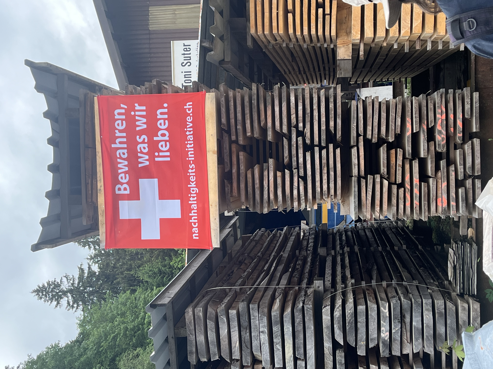
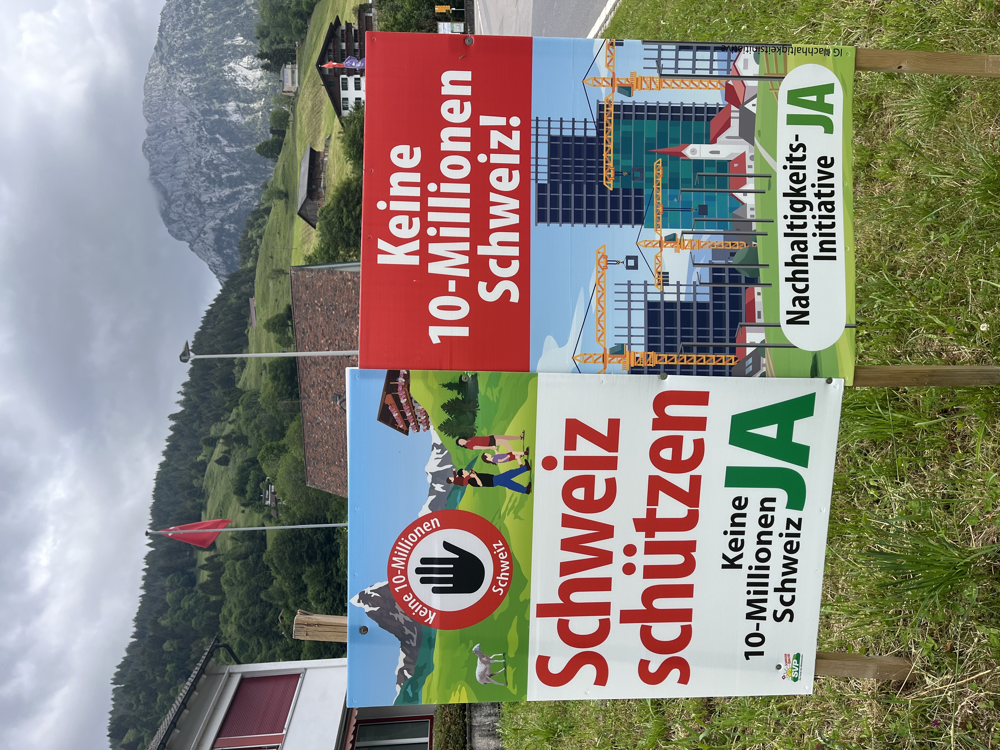
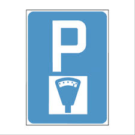
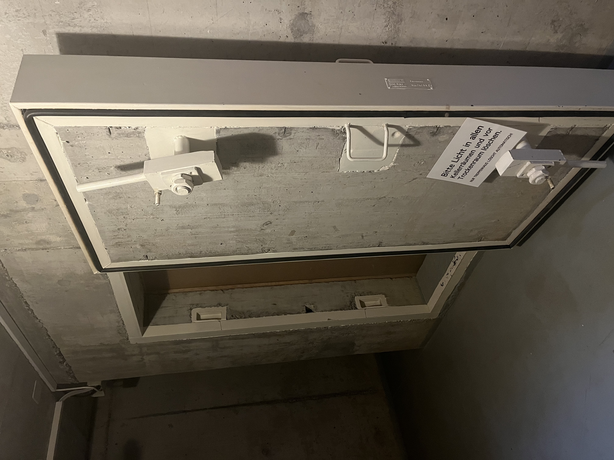

    ---
title: "Anders"
date: 2026-06-08
draft: false

---
Zwitserland is anders. In vele opzichten tegenover Frankrijk, Nederland en België, de landen die wij het beste kennen. Misschien heeft een deel er ook mee te maken dat we nu verblijven in Schwyz, het meest conservatieve kanton van Zwitserland. Hier zijn nog veel boeren en elke koe die je hier ziet rondlopen hoor je ook; ze hebben allemaal een bel aan. We dachten dat dit iets was van de alpenweiden, maar nee, ook in de vallei bellen ze van jewelste. Het is ook te merken aan de klokken in de kerktoren van het dorp. Hier wordt nog geluid volgens het liturgisch patroon. Ze luiden het kwartier, halfuur en uur. En op een doordeweekse dag het ochtendluiden om 6 uur, het middagluiden om 11 uur en het avondluiden om 19 uur. Dat is niet zomaar even, maar dat duurt minstens 5 minuten. En dan wordt er ook nog geluid gemaakt 30 minuten en 15 minuten voor de mis, het begin van het weekend en op godsdienstige feestdagen. Er is ook nog een specifiek luiden voor een overlijden of huwelijk. Eigenlijk hoor je hier bijna altijd wel klokken luiden. Ofwel die van de koeien, ofwel die van de kerk. :-)

Zodra we hier aankwamen, zagen we ook veel van deze spandoeken hangen. Dat heeft dan weer te maken met iets typisch Zwitsers dat wij niet kennen: de nationale referenda. Deze keer wordt er gestemd over 2 vragen. Het duurzaamheidsinitiatief en het over de wijziging van de wet op de burgerdienst. 

Vooral dat eerste thema ligt hier blijkbaar gevoelig. Het stelt voor om de permanente bevolking van het land tot het jaar 2050 wettelijk onder de grens van 10 miljoen te houden. Er staan ook nog andere plakkaten, zoals: wij gaan ons niet laten dirigeren door andere kantons.

Nog zoiets 'raars' is dat je bijna altijd moet betalen om je auto te parkeren. Begin ergens een wandeling 'in the middle of nowhere'. Er is een kleine parking, maar er zal betaald worden. Geen enkele parking is onbetaald of slechts voor korte duur.

In ons gebouw, alsook in elk groot gebouw, is een atoomschuilkelder verplicht.

Anders toch?
