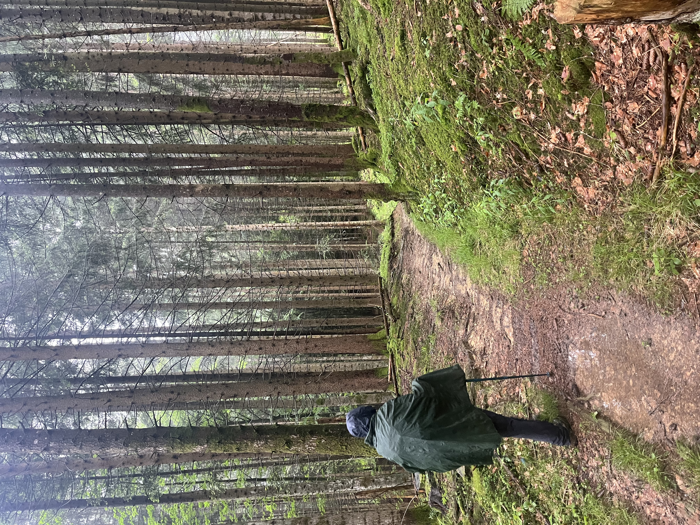
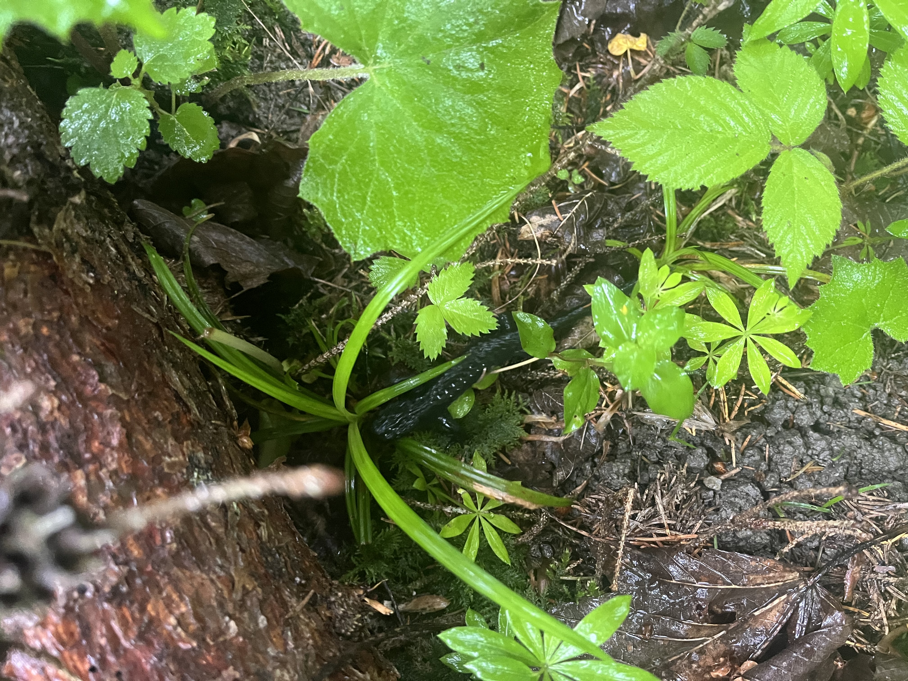
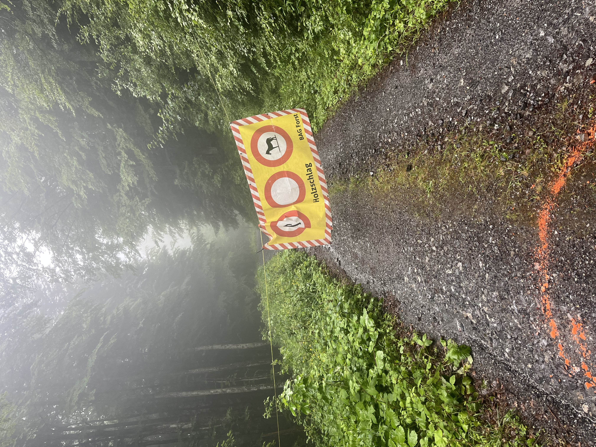
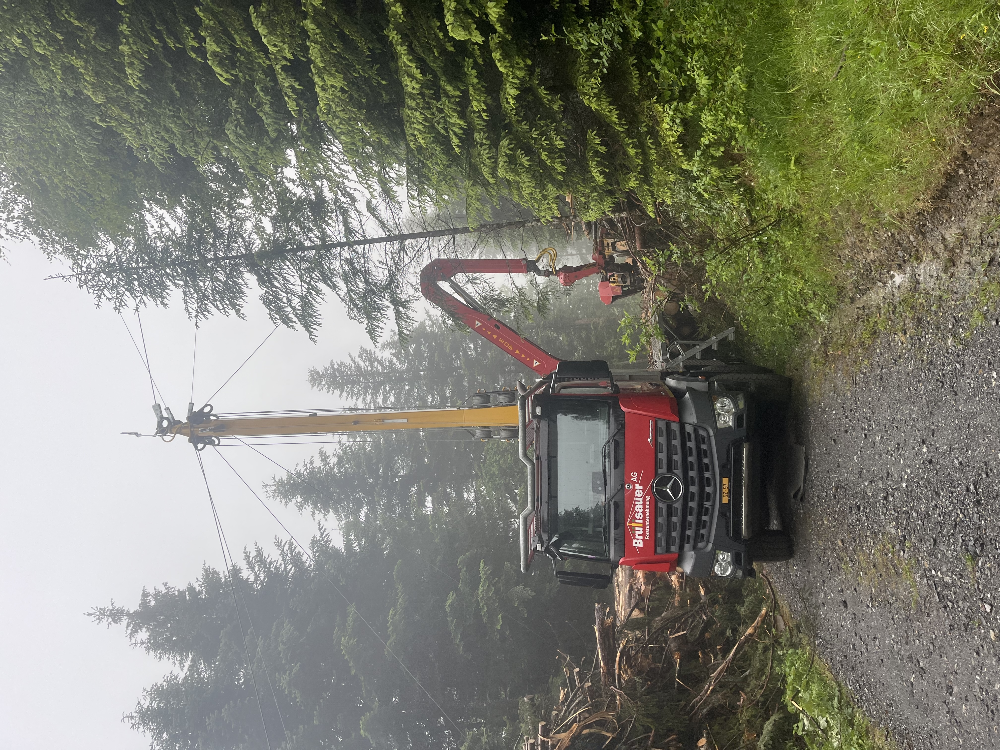

    ---
title: "Holzschlag"
date: 2026-06-09
draft: false

---

Vandaag, ondanks de regen, toch maar wandelen. 

Een wandeling over brede bospaden, soms steilere en smallere wegen van het ene naar het andere bospad.
Weinig activiteit van vogels door de regen; die schuilen ook in hun hut. :-) We verstoren een salamander. Na achteraf opzoeken blijkt het een Alpenlandsalamander te zijn. Toch weer een nieuwe soort erbij.

Als we bijna terug zijn bij ons vertrekpunt stoten we op een spandoek. Aai, aai, we weten van eergisteren dat ze hier bomen aan het kappen zijn. We mogen hier niet door. Echter, we weten dat we kilometers zullen moeten terugwandelen. De bospaden zijn hier schaars. We wagen het er toch maar op. Onze host is er niet bij, maar die had al gezegd: Zwitsers zijn héél gezagstrouw, die doen zulke dingen niet. We zien het absoluut niet zitten om terug te gaan. De regen heeft ons kletsnat gemaakt.

Na een vijftal minuten verder wandelen horen we de kettingzagen al en staat er een grote camion in het midden van het bospad. De hellingen zijn hier heel steil en dit is een speciale camion om de gekapte stammen via kabels over de hellingen te transporteren. We kunnen absoluut niet verder. Achter de camion liggen de gekapte stammen hoog opgestapeld. Daar staan we...

Na een tijdje valt de camion stil, waarschijnlijk door een technisch probleem. We proberen de aandacht te trekken van de operator, in de hoop om toch te vragen of we even kunnen passeren. De operator staat te bellen met zijn collega verderop op de berg, maar doet alsof hij ons niet ziet staan. Logisch, want we worden hier niet geacht te zijn. Besluiteloos en wanhopig staan we daar. Dan maar 2 uur terugwandelen?

Gery kijkt even op zijn kaartje en ziet dat de hoofdbaan op enkele honderden meters kruist met de bosweg. We waren er bijna! Langs de rechtse kant van het bospad is het iets minder steil. Dan maar even op verkenning. Ja, het zou lukken: eerst een stuk door het bos en dan een moerassig stuk met watergeulen. De voeten nog wat meer nat, maar we halen het. Oef! 
