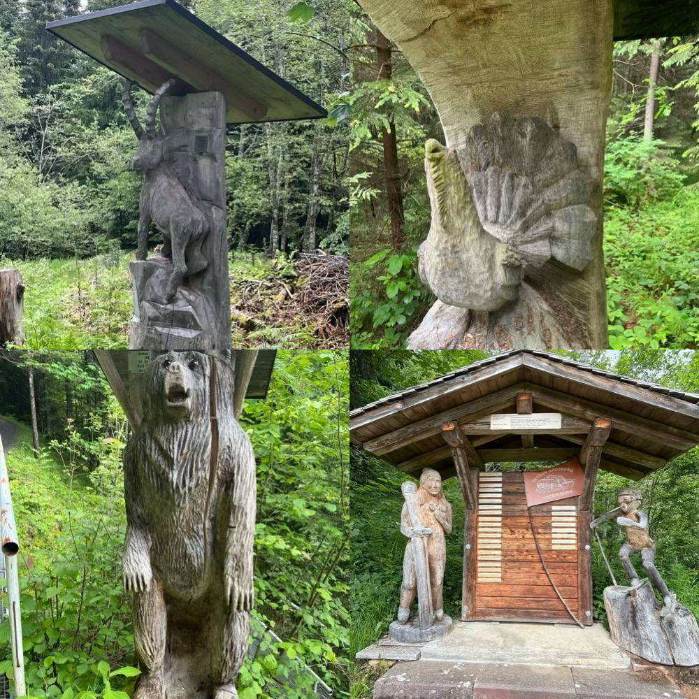
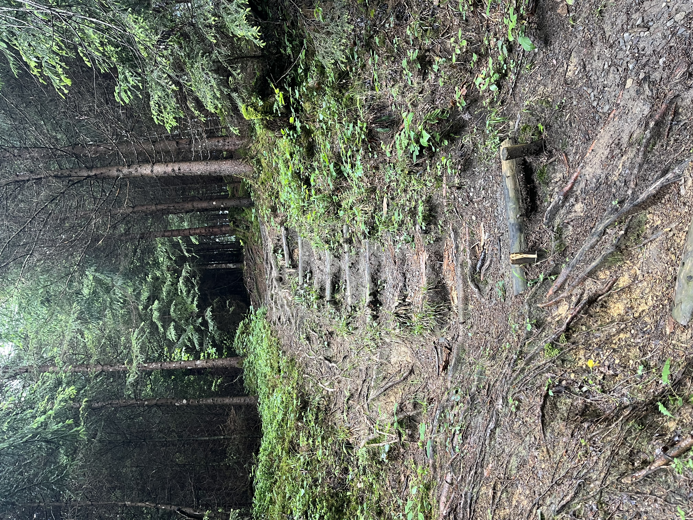
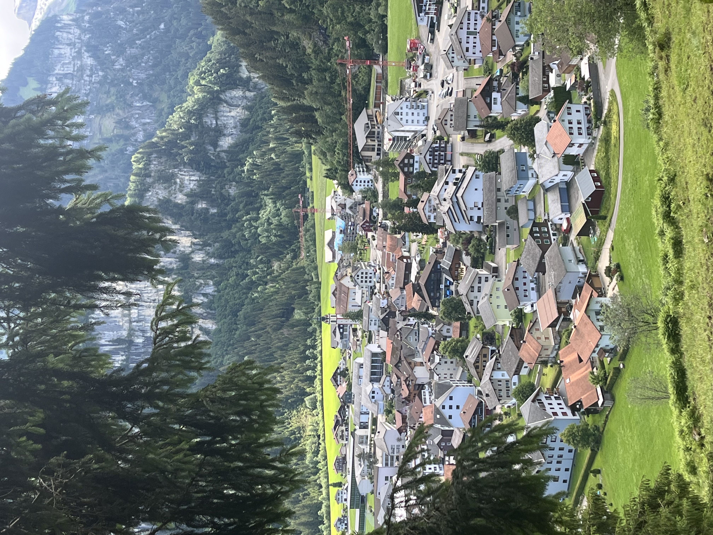
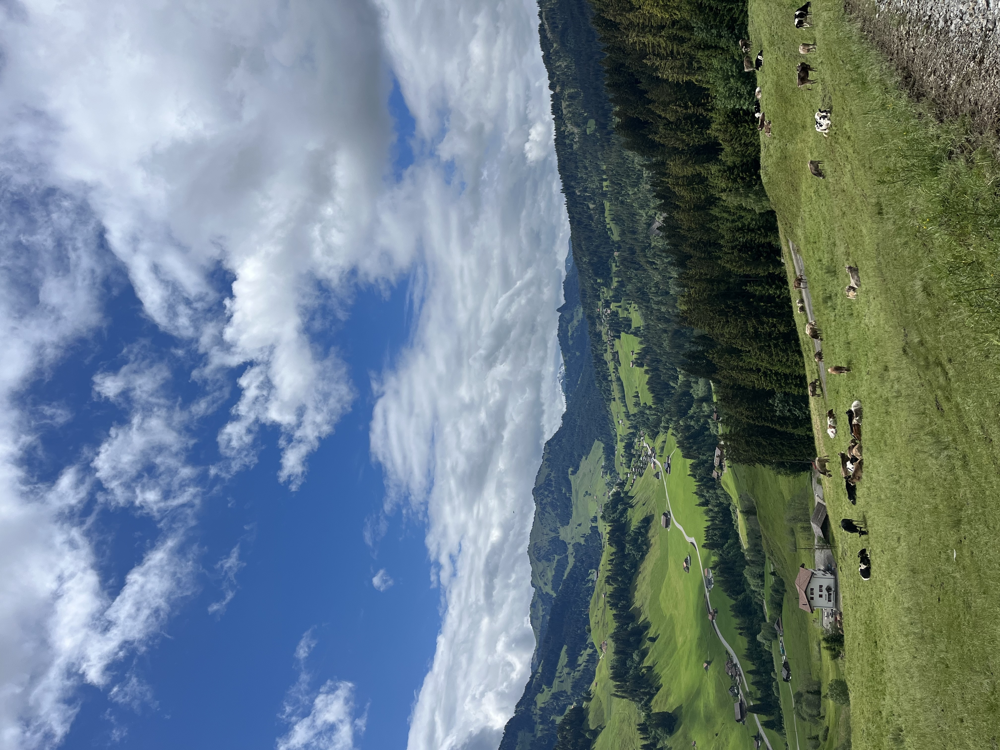
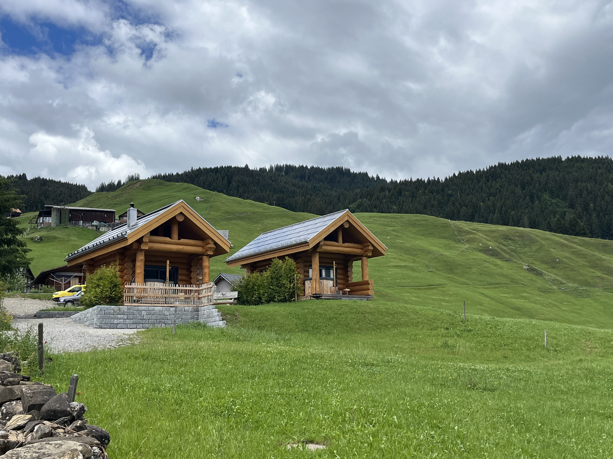
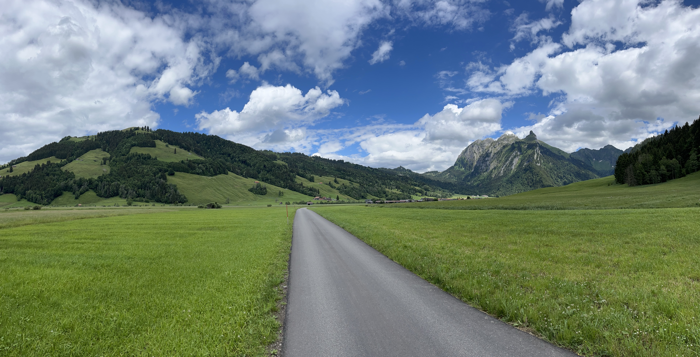

    ---
title: "Uitzichten"
date: 2026-06-11
draft: false

---

Gisteren is er van wandelen niet veel in huis gekomen, een zware regendag en we waren eergisteren al goed nat. Maar vandaag is het prachtig wandelweer. En we vertrekken van op onze slaapplaats, dan zijn we vlug aan het stappen. Er loopt een wandeling over de berg langs houtsculpturen.

In het begin heel tof, maar al vlug gaat het steil bergop. Je zou het niet zeggen op deze foto, maar dit is toch meer dan 20%. We noemen dit ademtrappen.

 

Toch weer blij als we 250 m hoogteverschil hebben overwonnen en we kunnen genieten van het uitzicht op het dorp.

En als we helemaal boven zijn.

Als we bijna terug beneden zijn, maken we nog even een ommetje langs 2 luxueuze loghome tiny houses die onze host mee heeft helpen bouwen.

We wandelen een uurtje tot aan de volgende vallei en het volgende dorp. Weer een ander uitzicht.

