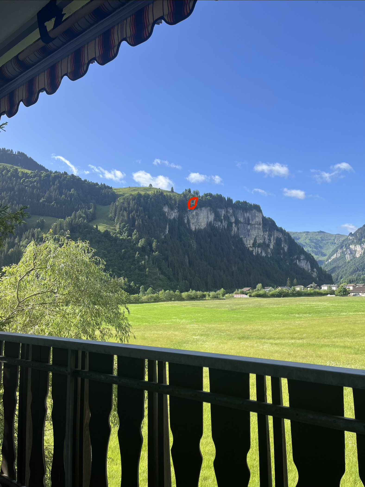
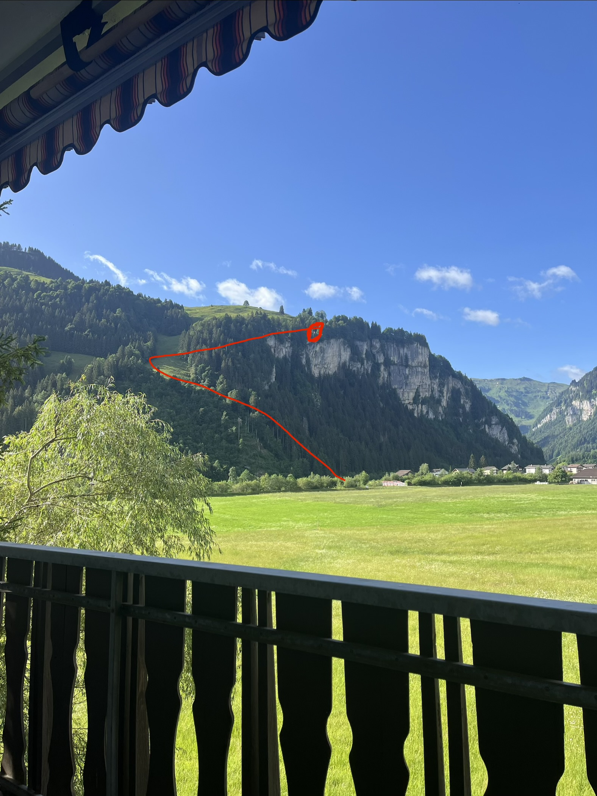
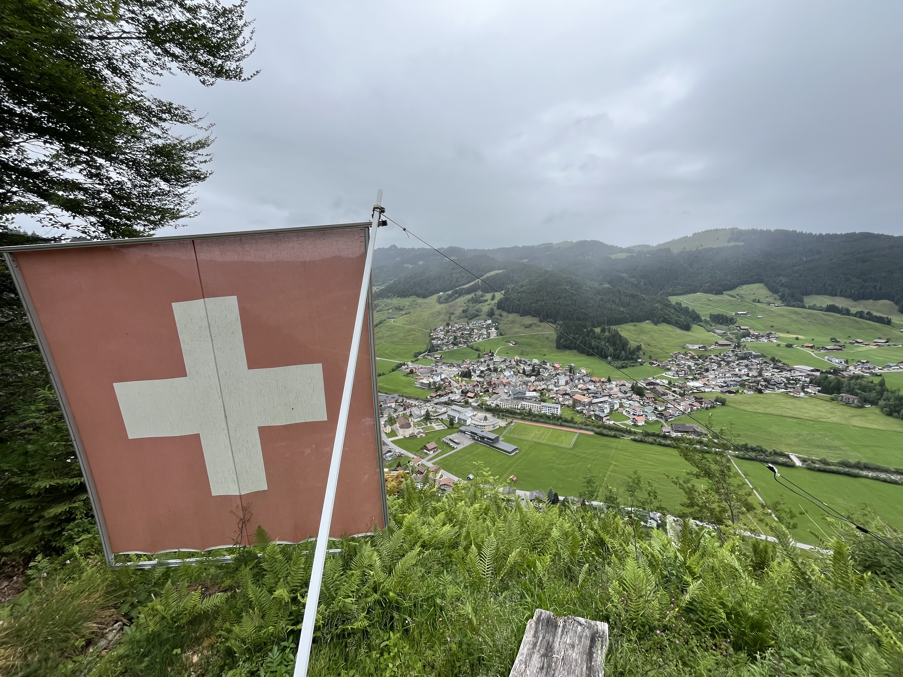
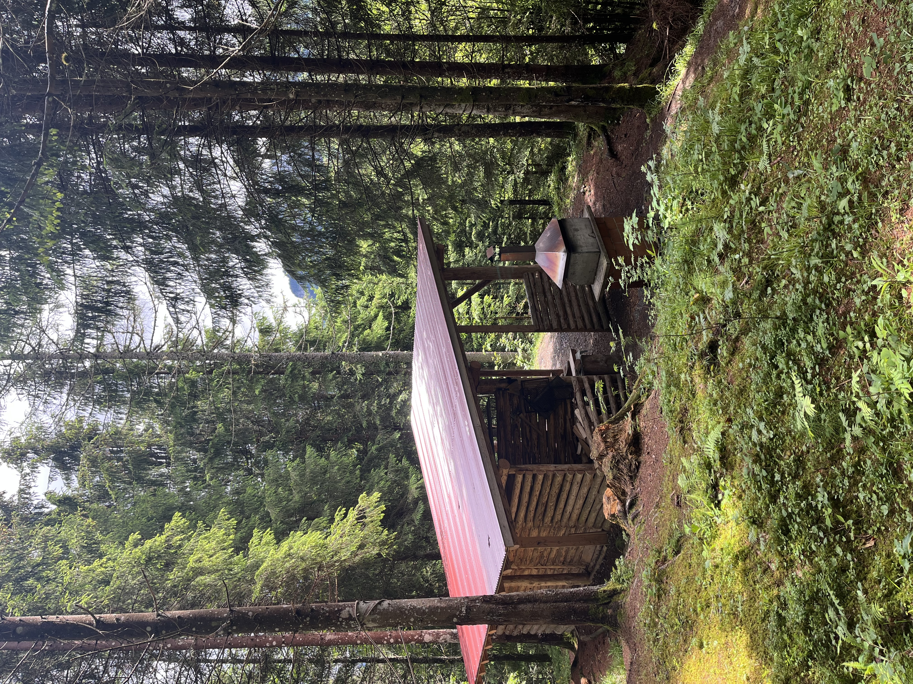
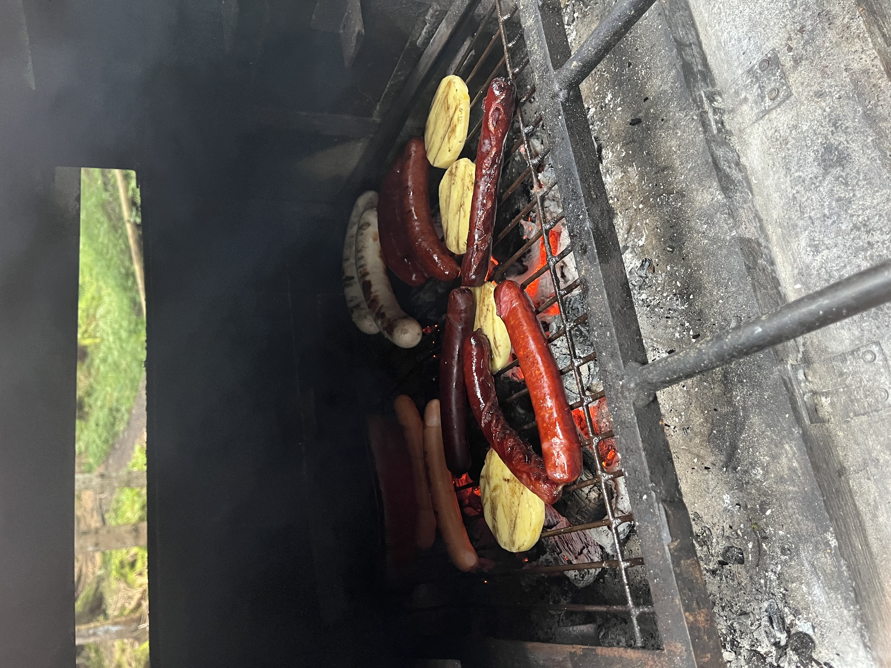
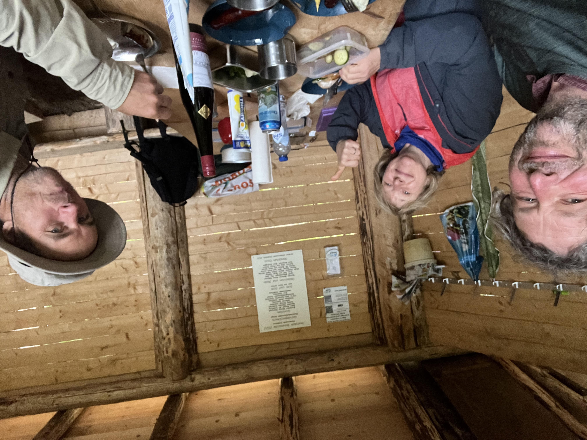

    ---
title: "De vlag"
date: 2026-06-12
draft: false

---

Vanop het balkon van onze slaapplaats hebben we uitzicht op een rotswand. Op de kant van deze rotswand staat een grote Zwitserse vlag. Hier op de foto amper te zien.

Onze host is daar al verschillende keren naartoe gewandeld; het is dus mogelijk. Alhoewel het pad ernaartoe zeer steil is, gaan we het erop wagen. Toch wel met een klein hartje, want grote wandelhelden zijn we niet. In het begin valt het nog mee; er zijn onregelmatige trappen. Na een tijd klimmen slagen we er toch in om aan de open plek te geraken waar we van richting moeten veranderen. Er staan schapen te grazen. Hoe kunnen die beesten hier in godsnaam staan?!  De weide is écht heel steil. We voelen ons totaal niet op ons gemak, want we zijn uit de beschutting van het bos en om terug in het bos te geraken, moeten we de weide oversteken naar het volgende stuk bos.

We sukkelen toch maar verder; ook in het tweede stuk bos gaat het nog heel steil omhoog. Maar aan de vlag is het uitzicht over het dorp echt wel de moeite.
Na de vlag wandelen we nog verder. Van hieraf kan je verder de bergen in tot aan toppen van 2000 m hoog. Maar na nog een flink stuk wandelen en slechter weer besluiten we via een andere weg terug naar de vallei te keren. Voor vandaag hebben we meer dan genoeg gewandeld. In totaal +12 km als we terug thuis zijn.

Op een vorige wandeling waren we een goed uitgeruste grillstelle tegengekomen. Iets wat je hier op veel plaatsen vindt.
Deze staat echt wel afgelegen; je mag er zelfs niet met de auto naartoe rijden, maar we wagen het er toch op. Er ligt aansteekhout, grote blokken hout, een grilltang, borstels, een bijl en er staat een grote grill met schouw. Hier kan je gemakkelijk met 30 man een grote party houden.

 
Een uurtje later is ons eten klaar. Worsten, spek en grillkaas. Hmmm!

We laten het ons smaken!

