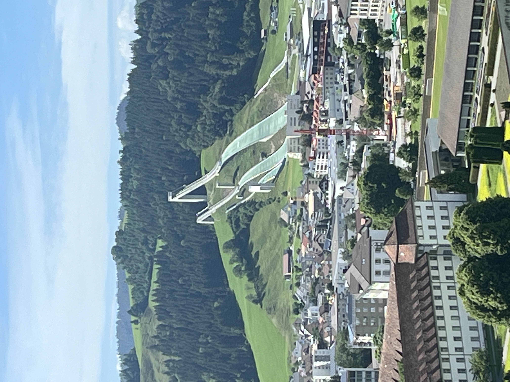
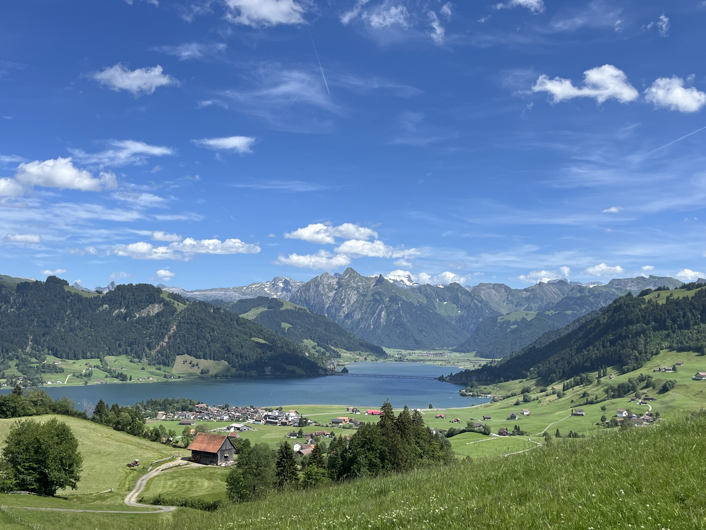
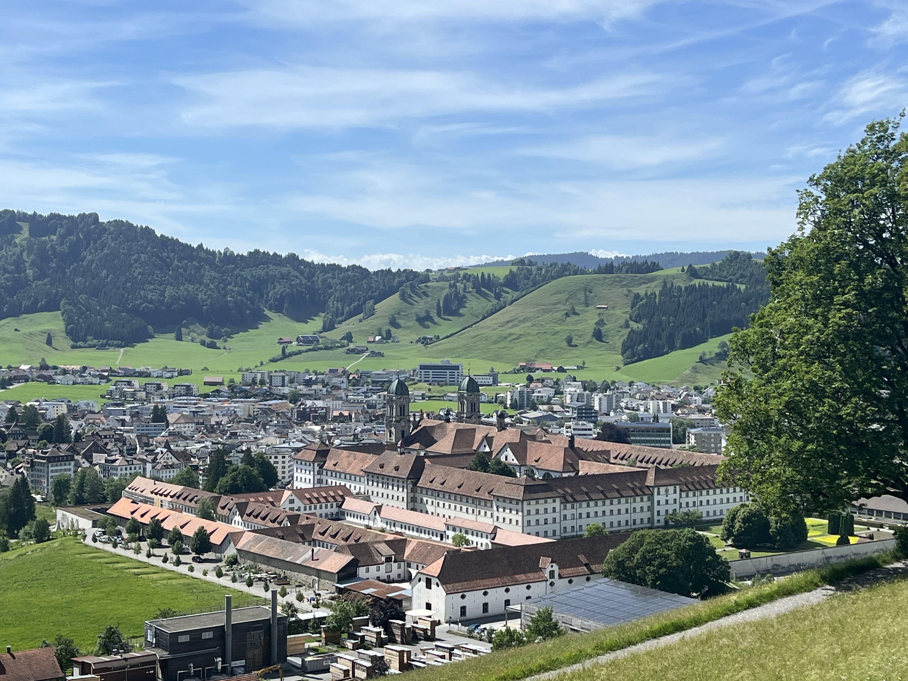
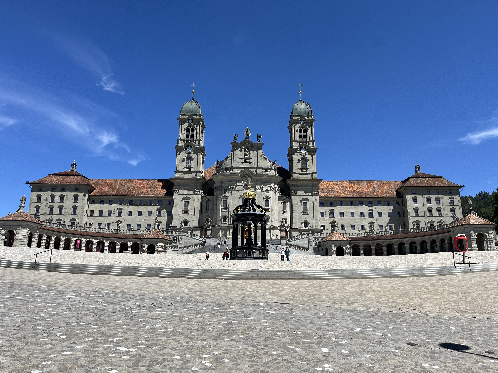
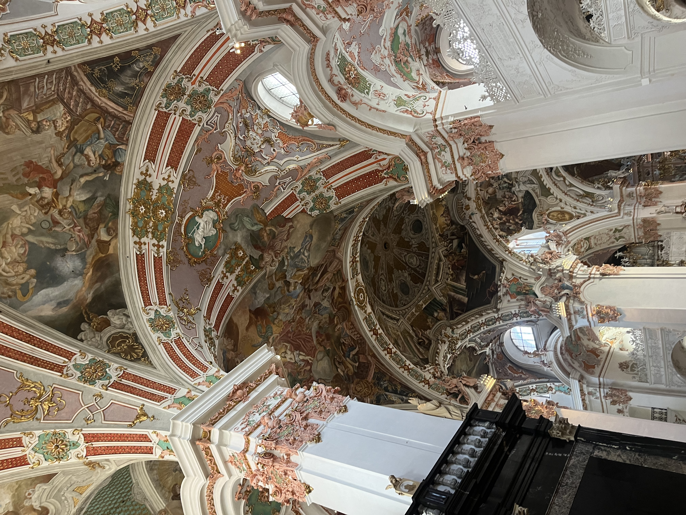

    ---
title: "Einsiedeln"
date: 2026-06-13
draft: false

---

We brengen een bezoek aan Einsiedeln. Dat is een stad van 15000 inwoners. Niets speciaals, zou je zeggen, maar deze stad is heel bekend om zijn klooster. Je kan er ook prachtig wandelen, want het is omringd door heuvels. Aan de ene kant van de stad zijn er zomerschansen van verschillende lengtes. Skispringers kunnen dus ook in de zomer trainen en dit is de belangrijkste zomertrainingslocatie voor schansspringen van Europa. 

Wij kiezen echter voor een wandeling op de heuvel dichter bij het klooster. Al vlug hebben we een prachtig uitzicht over de Sihlsee en het begin van de Alpen. Wij komen van over de brug over de Sihlsee, een kwartiertje rijden met de auto.

Wat ons echter het meest verbaast, is hoe immens groot het klooster is en hoe het de stad overheerst! Einsiedeln is ontstaan dankzij het klooster. In 835 was er een benedictijner monnik die een kleine hut bouwde in wat destijds het Finstere Wald werd genoemd, de onherbergzame hoogvlakte waar Einsiedeln nu ligt. Echter, de monnik Meinrad werd vermoord en later heilig verklaard. In 934 besloot een edelman een klooster te bouwen volgens de officiële orderegels van Sint-Benedictus. Hij stichtte een klooster op de exacte plek van Meinrads oude kluis. Dit was de officiële geboorte van Kloster Einsiedeln. Het klooster kreeg al snel een mythische status door een beroemde legende: de Engelweihe (Engelenwijding) in 948. Toen de bisschop van Konstanz de nieuwe kloosterkapel wilde inwijden, hoorde hij 's nachts plotseling hemelse gezangen. Jezus Christus zelf zou, samen met engelen en heiligen, de kapel al persoonlijk hebben ingewijd. Dit verhaal verspreidde zich als een lopend vuurtje door Europa. Het maakte de kapel tot één van de meest heilige plekken op het continent, waardoor de pelgrimsstromen explodeerden. Door de duizenden pelgrims die jaarlijks naar de kapel trokken, groeide het klooster uit tot één van de rijkste en machtigste instellingen van Centraal-Europa.

Tot zover een beetje geschiedenis. Het klooster straalt rijkdom en status uit, zowel langs de buitenkant als in de uiteindelijke kerk. Het klooster is de grootste privéland-eigenaar van Zwitserland en heeft zelfs een eigen zagerij om hout te verwerken. Ook enkele exclusieve wijngaarden aan de Zürichsee. 

Je mag gelukkig redelijk vrij rondlopen en alles verkennen. Er is ook een zeer grote stoeterij; de paarden die hier gefokt worden zijn gegeerd over de hele wereld.

Wij kwamen binnen op het moment dat de monniken een misviering bijwoonden. Zodra je de kerk binnenkomt, is er achteraan in het midden de genadekapel. Er wordt gevraagd om geen foto's aan de kapel te nemen om de sereniteit niet te storen. In deze kapel staat het beroemde zwarte madonnabeeld. Dit 15de-eeuwse beeld is door de honderden jaren kaarsen branden op het gezicht en de handen helemaal zwart geworden. We waren even aan het rondkijken en de misviering liep op zijn einde. Wat we echter niet wisten, is dat de monnikken na de vespers in processie vanuit het koor van de kerk naar de genadekapel komen. Eerst 2 dienaars met grote kaarsen, dan 3 priesters, gevolgd door een schare monniken. Ongelooflijk indrukwekkend was dat zodra de monnikken in de kapel aankwamen ze meerstemmig het Salve Regina zongen. 

<audio controls>
  <source src="SalveRegina.mp3" type="audio/mpeg">
  Je browser ondersteunt geen audio.
</audio>

We waren helemaal aan de grond genageld door dit indrukwekkende en rustgevende ritueel. Zeker meemaken als je in de buurt bent!

's Avonds was er in het dorp waar wij verblijven een dorpsfeest gepland. Het eerste in 25 jaar. Raar, want het dorp telt heel wat verenigingen. Als we aankwamen, stond er een blaasorkest te spelen. Nadat deze gedaan had, hoorden we koeienbellen. Door het talrijke opgekomen publiek marcheerden zeker 30 man met 2 enorme koebellen geschransd op hun schouders. Het maakte een hels lawaai. Dit is al een eeuwenlange traditie om boze geesten te verjagen, meestal 1 maal in de winter, maar vanwege het dorpsfeest ook vandaag. Een bizar schouwspel.

<video controls width="100%" style="max-width: 720px; margin: 1rem auto; display: block;">
  <source src="bel.mp4" type="video/mp4">
  Your browser does not support the video tag.
</video>
