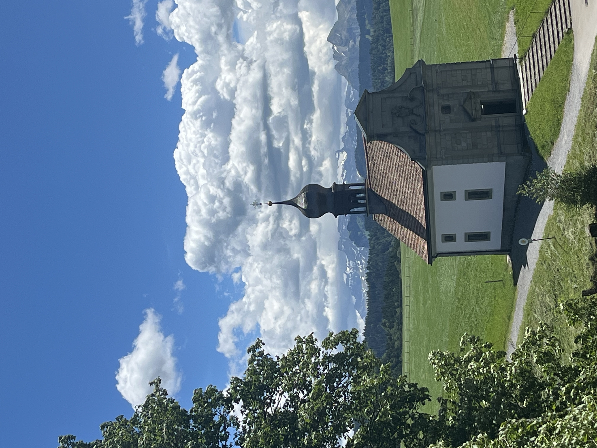
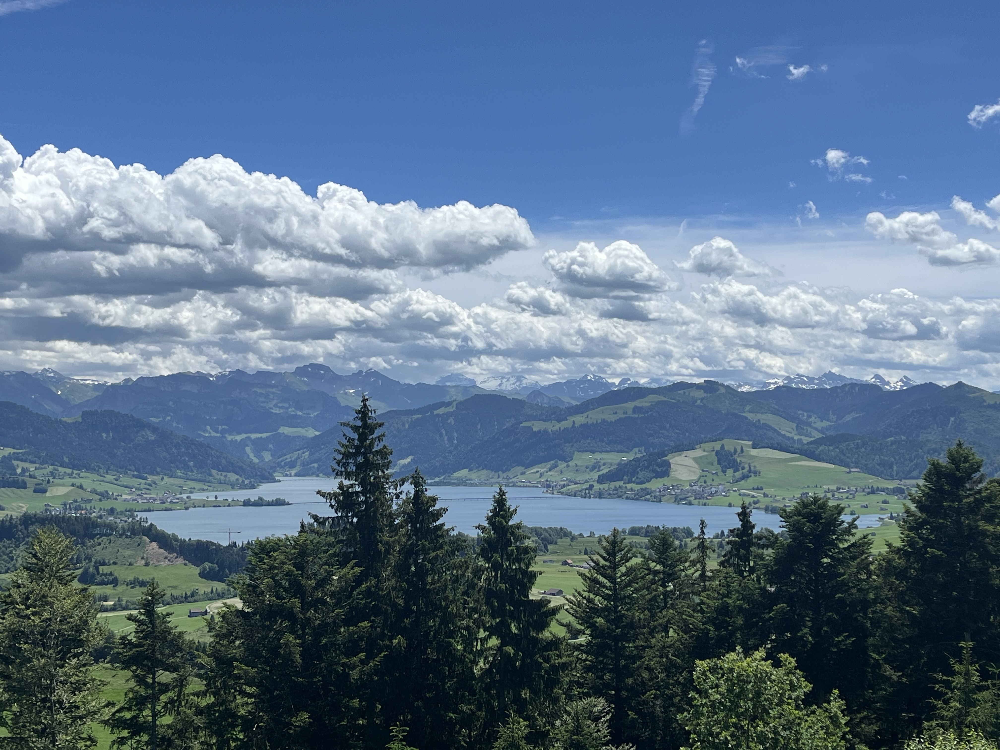
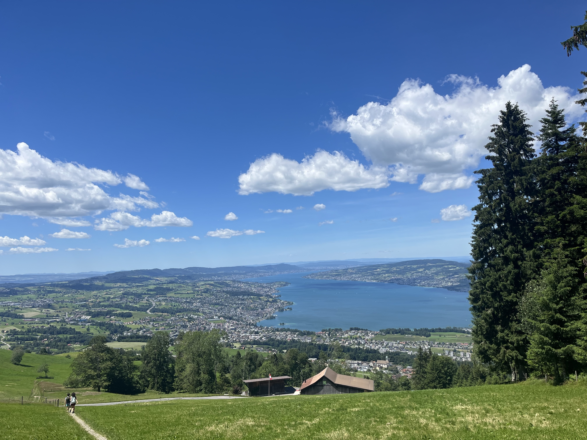
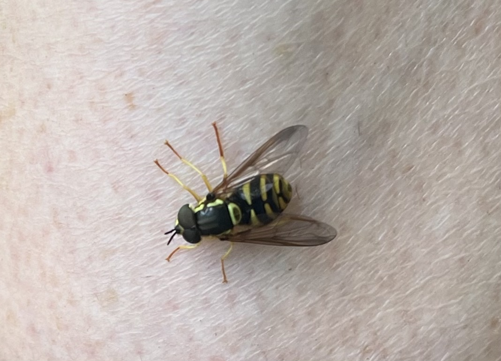
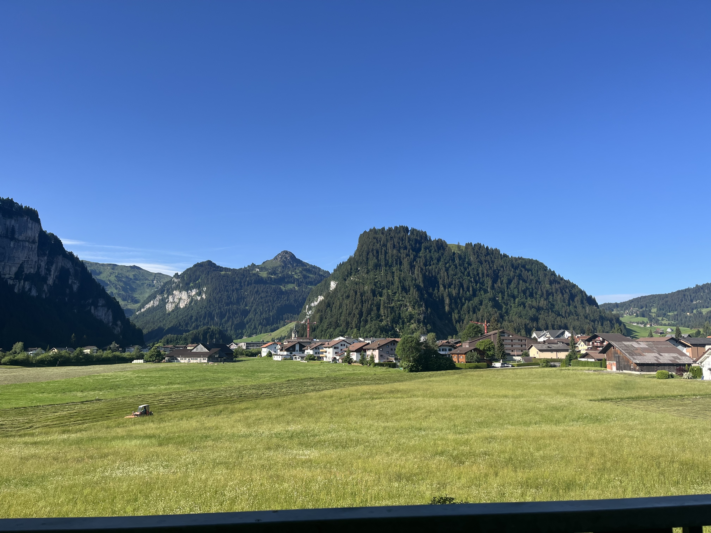

    ---
title: "Höhepunkt"
date: 2026-06-14
draft: false

---

Wat ons verwondert, is dat je op korte afstand toch zoveel verschillende landschappen kan vinden. We rijden vandaag naar Etzel, dat is slechts 30 minuten met de auto. Onderweg verandert het landschap van een grote, brede vallei met bergen op de achtergrond naar nijdige, kortere hellingen. Etzel en omgeving is ook heel populair bij fietsers, tenminste als je een beetje conditie hebt of elektrisch fietst. Onze host kent hier dankzij zijn werk overal de weg en was zeker dat we hier wel een mooie wandeling zouden kunnen maken. We starten onze wandeling aan de St. Meinradkapel. Je weet wel, monnik Meinrad, die in 835 vermoord is in Einsiedeln.

Al vlug gaat het stevig omhoog. Dat belooft :-) Een half uurtje later staan we op de top van de Etzel. Daar is een bergrestaurant, maar ook een adembenemend uitzicht. Langs de ene kant kijk je naar de Sihlsee met daarachter hoge besneeuwde alpentoppen. 

Aan de andere kant is het uitzicht nog indrukwekkender. Je kijkt uit op de Zürichsee en ziet aan het einde van het grote meer Zürich liggen. Het was een zonnige dag en we konden zeker 70 tot 80 km ver kijken. Dat maakt wel indruk op ons; we zijn zulke uitzichten absoluut niet gewoon. 

We wandelen tot bijna aan de Zürichsee en maken een mooie lus om terug bij de St. Meinradkapel aan te komen.
Onderweg is er nog even commotie over een wesp die op iemands been gaat zitten. Het is echter een fopwesp, een zweefvlieg die zich voordoet als wesp.

We keren terug naar het uitzicht van onze slaapplaats. Helaas zit het gedeelte Reis naar Zwitserland erop. Morgen rijden we terug richting Frankrijk, naar de Jura.

