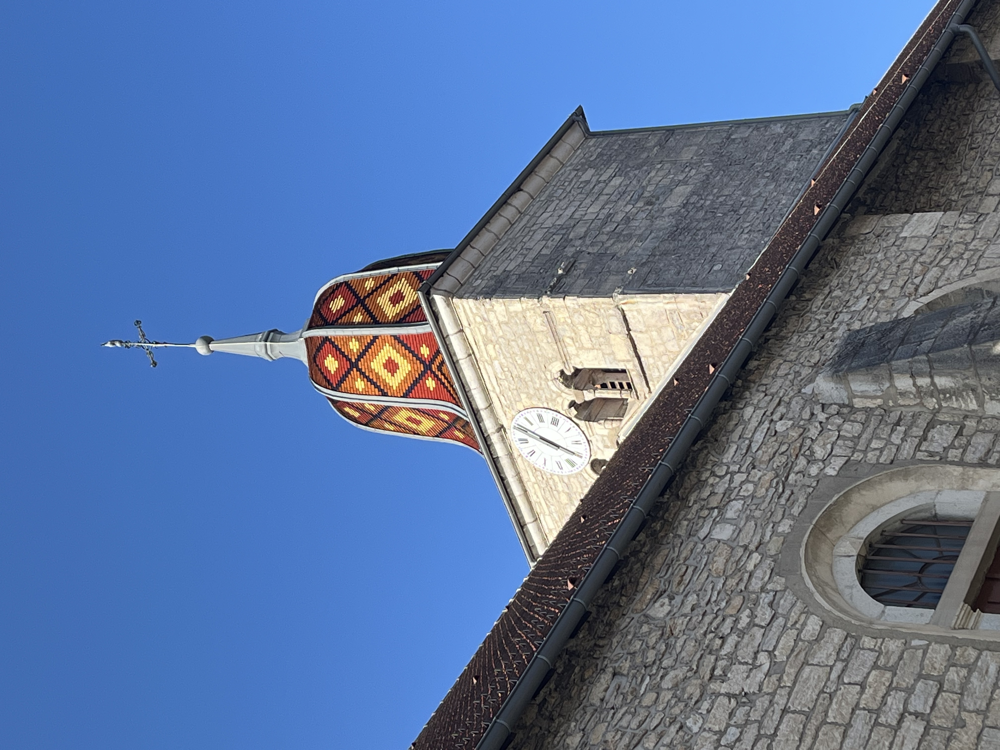
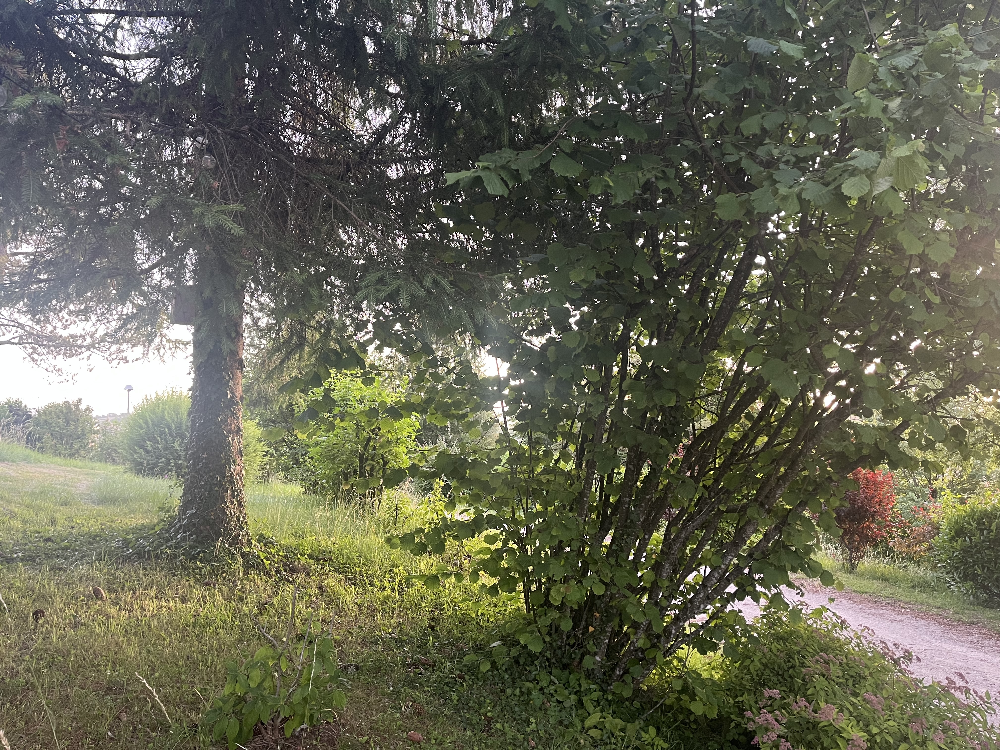
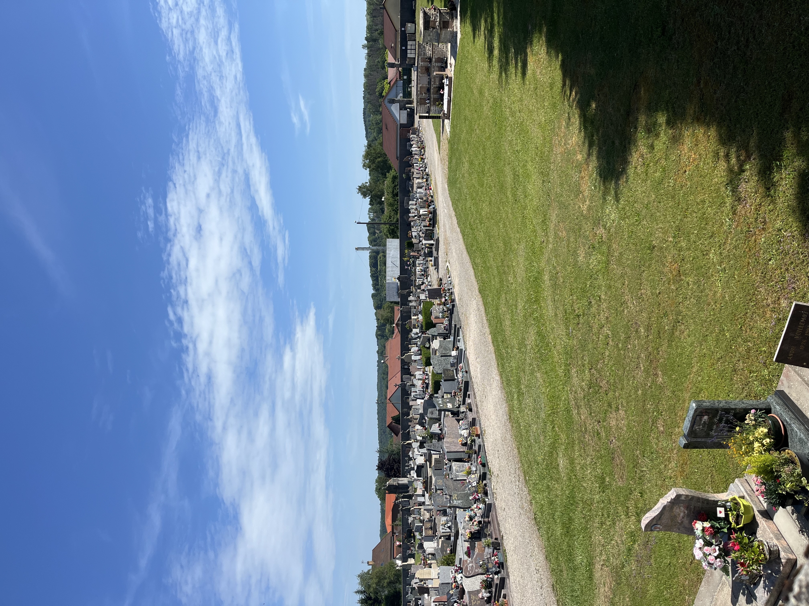
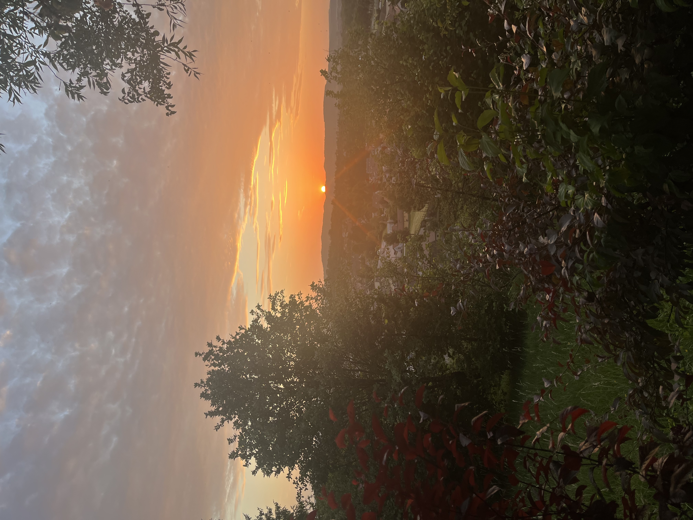

    ---
title: "Jura        "
date: 2026-06-15
draft: false

---

We hebben Zwitserland verlaten en zijn nu in de Jura, Frankrijk. Daar zijn we eerder geweest, maar een stuk noordelijker dan waar we nu zitten. 9 jaar geleden zijn we van Port-Lesney via Salins-les-Bains tot Arbois gewandeld. Onze bagage werd achterna gebracht. Een hele andere streek dan waar we nu zitten. Arbois is de hoofdstad van de Jura-wijn. Daar hebben ze druivensoorten zoals poulsard en trousseau waar we nog nooit van hadden gehoord. Of de vin jaune. We stapten drie dagen door wijngaarden. Een grappige anekdote van toen is dat we van al die wijngaarden toch wel eens benieuwd waren naar de wijnen. We stopten bij een wijnbouwer en vroegen waarom we in België nooit wijnen van de Jura vonden. Monsieur, zei de verkoopster, de Jura produceert 3% van de totale wijnproductie van Frankrijk en de wijn is zo lekker dat wij alles zelf opdrinken! :-) Genoeg geleuterd, nu zijn we in Clairvaux-les-Lacs, dat ligt aan de grens van het Parc régional du Haut Jura. Zoals de naam van de stad al zegt: bij meren. 
We verkennen de stad en merken al direct dat ze hier ook houden van klokken luiden. 

Achter onze slaapplaats staan koeien met bellen. Op zich lijkt het niet veel te verschillen van Zwitserland. Toch wel, Zwitserland is 'proper' met kortgeschoren weiden en veel glad asfalt. Hier is het veel ruiger. Als er al asfalt ligt, is het slecht asfalt op de wegen. Niet aan de opritten van de huizen. Hier een foto van het uitzicht op ons terras. We zitten in het hoogst gebouwde huis van de stad, dus we hebben wel een mooi uitzicht. Het centrum is 5 minuten wandelen.

De begraafplaats vonden we eerst raar. Als je goed kijkt op de foto, zie je een 'box' staan met schouw. We dachten: dit kan toch niet, ze hebben hier het crematorium wel heel dicht staan. Later ontdekken we dat dit een 'centrale chauffage' is met hout, een soort warmtenet. Hout is hier in ieder geval genoeg.

We genieten nog van een zonsondergang op ons terras.

