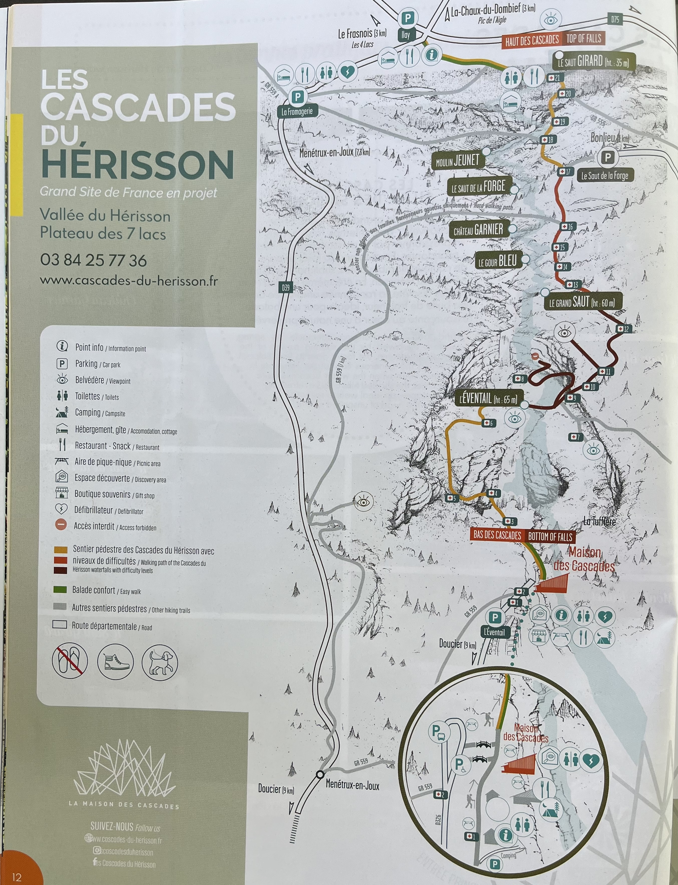
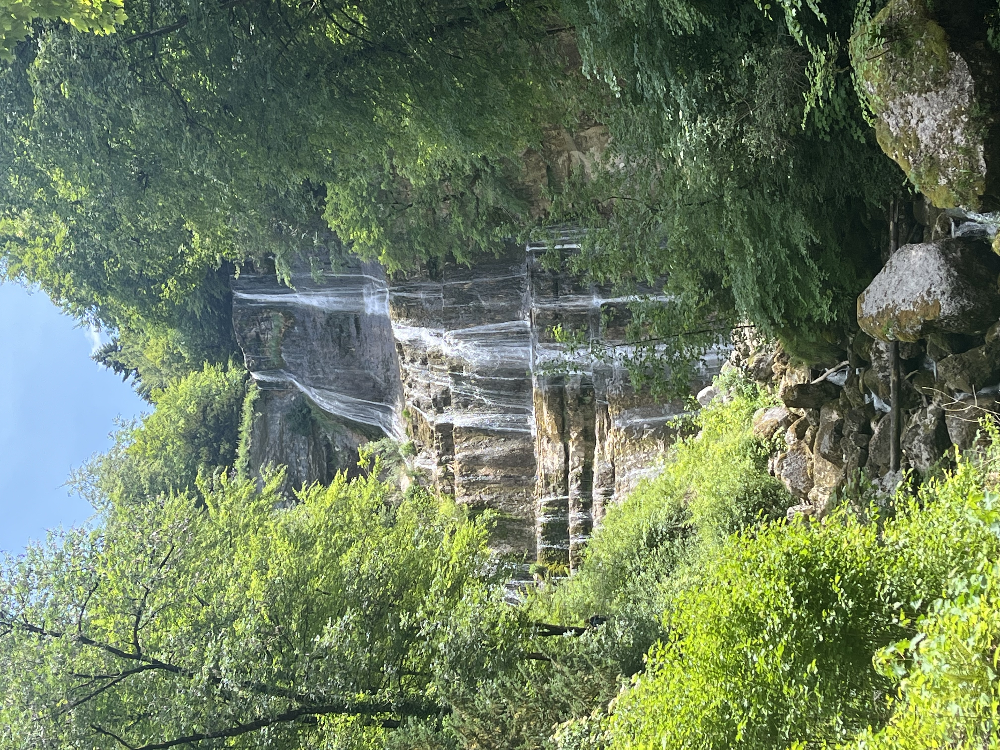
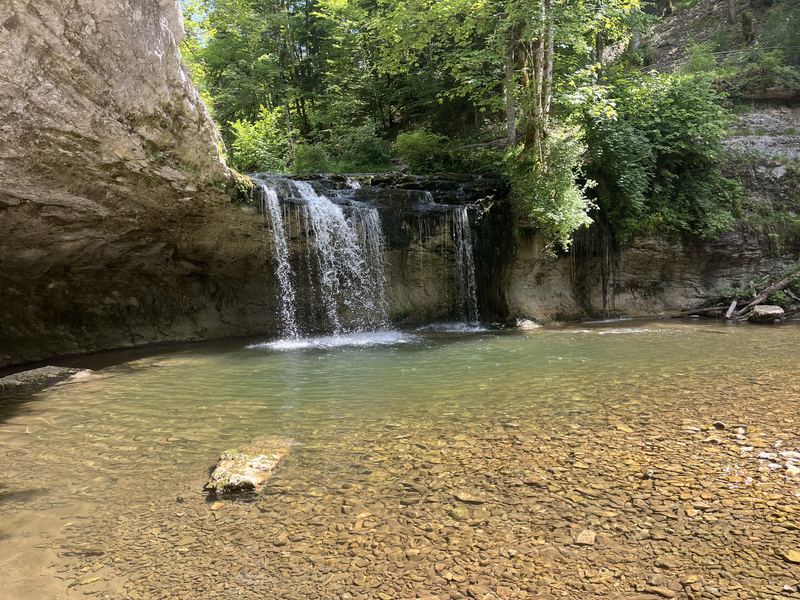
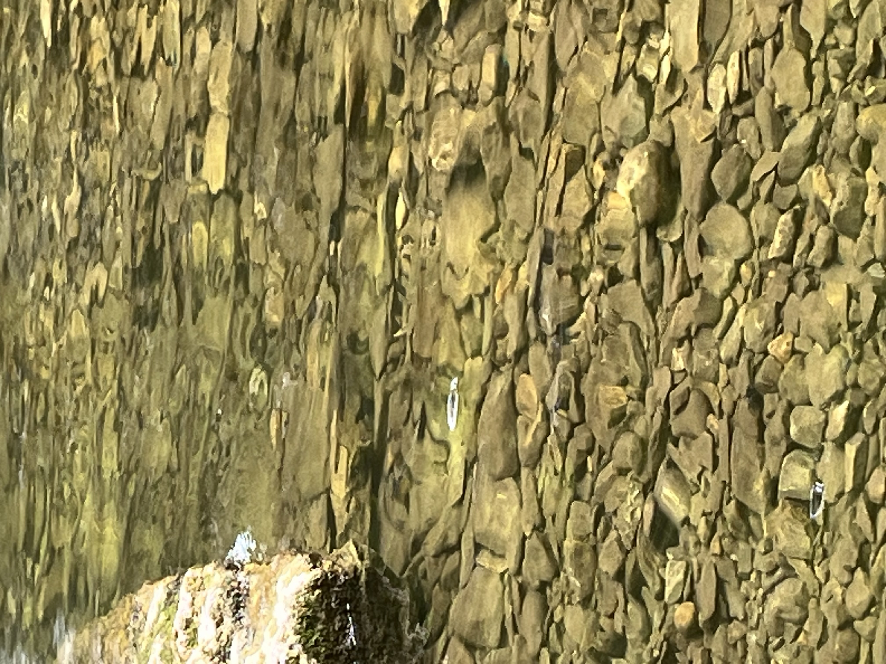

    ---
title: "Les Cascades"
date: 2026-06-16
draft: false

---

L'incontournable du Jura, zo beschrijft onze host de watervallen van de rivier Hérisson. Het gaat over een reeks van 7 watervallen over een afstand van ongeveer 3,5 km. De hoogste waterval heeft een val van 65 meter, de tweede hoogste 60 meter en dan 35 meter, etc. Er is een wandelweg naast, maar je moet dus wel wat hoogte overbruggen om ze allemaal te bekijken. Maar dit moet je natuurlijk geen twee keer vertellen tegen Gery. Sinds Noorwegen heeft hij een fascinatie voor watervallen. Dit wordt dus onze eerste wandeling in de Jura.

We merken al direct 2 nadelen op tegenover de watervallen in Noorwegen. Ten eerste loopt hier heel wat meer volk rond. Elk jaar ontvangen deze watervallen 400000 bezoekers per jaar én er valt hier niet zoveel regen als in Noorwegen. Dat merken we al direct wanneer we aankomen bij de Cascade de l’Eventail van 65 meter hoog. Het is meer een mini-stroompje dat van de rotsen glijdt als een indrukwekkende waterval.

Gelukkig is het hier wel heel mooi en naargelang de avond begint, wordt het rustiger. Niet de hoogste, maar voor ons is deze waterval wel de mooiste.

 

We blijven dus wat langer staan en Lisette zegt dat ze in de kom voor de waterval een zebravis heeft zien rondzwemmen. Huh!? Het duurt zeker een kwartier voor Gery de vis eindelijk ook ziet. We kijken door de verrekijker en waarachtig, deze vis heeft op zijn rug brede zwarte strepen die een stuk doorlopen tot op de zijkant. Het ziet eruit als een forel en de vis is actief aan het jagen, zoals een forel meestal doet. Wat raar! Een zoektocht begint op internet en we komen uit op een truite zebreé. Ultrazeldzaam! En wij komen dat hier tegen in het kommetje van de waterval! Wauw! Als we terug afdalen, komen we een tweede keer langs deze waterval. We zien andere forellen zwemmen, maar de zebraforel zien we niet meer terug. 's Avonds wordt er nog eens goed ingelezen op internet en blijkt dat de zebraforel niet meer bestaat, maar gehybridiseerd is met andere forellen. Het wordt hier omschreven als truite fario. Maar deze had echt strepen als een zebra. :-) Kijk naar de volgende slechte foto en geef ons gelijk ;-)

Tenslotte nog een filmpje van onze lievelingswaterval op de Hérisson.

<video controls width="100%" style="max-width: 720px; margin: 1rem auto; display: block;">
  <source src="val.mp4" type="video/mp4">
  Your browser does not support the video tag.
</video>
