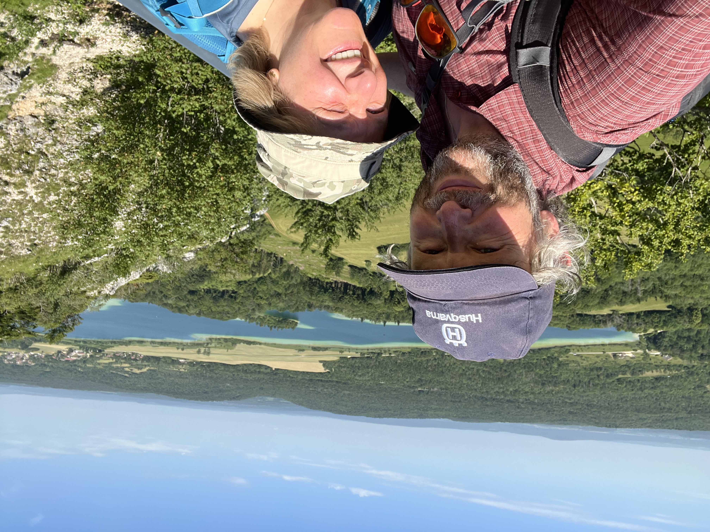
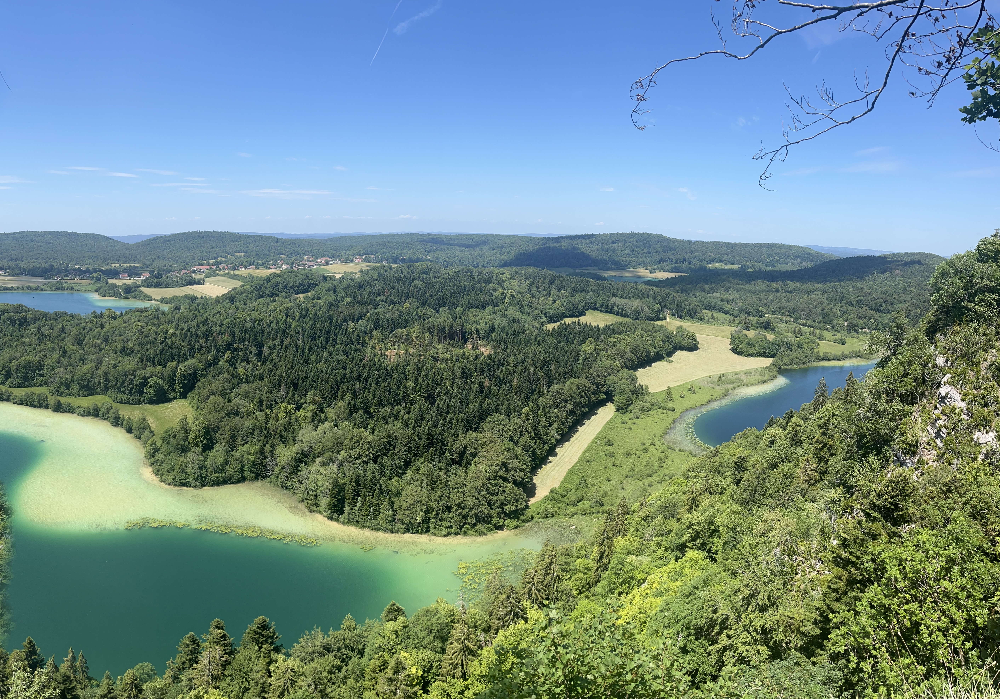
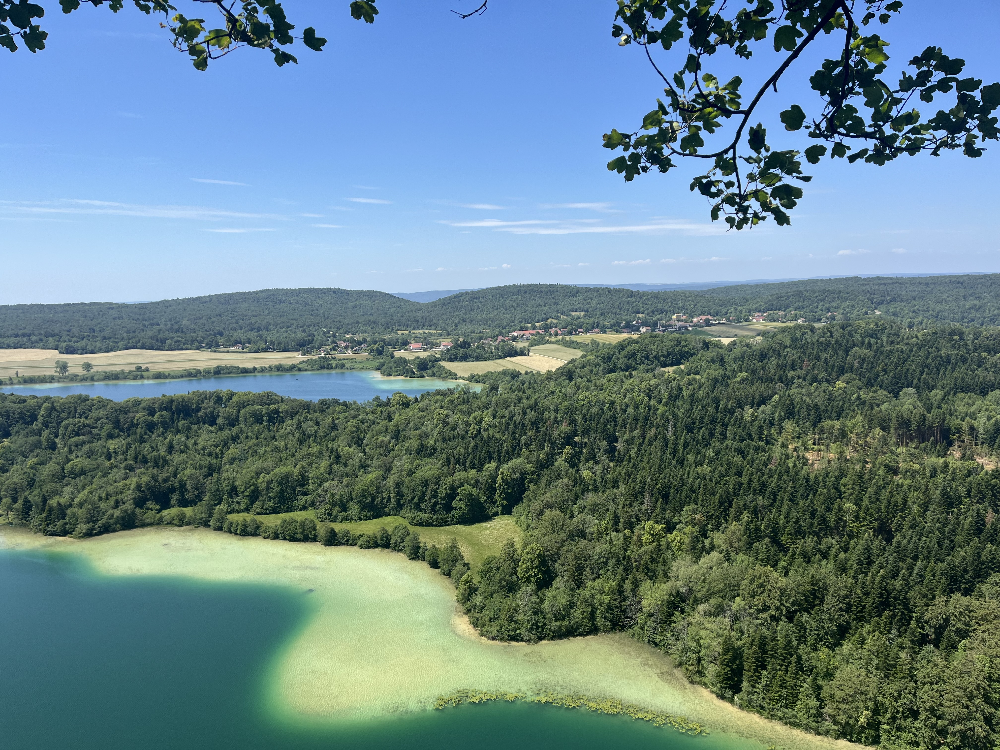
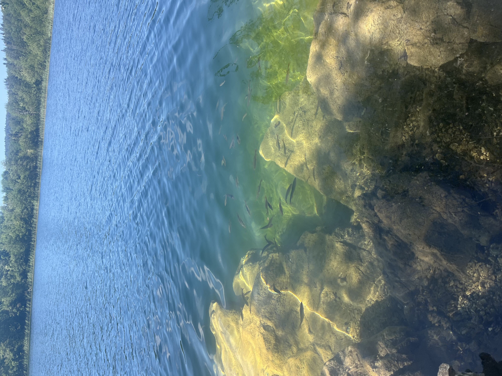
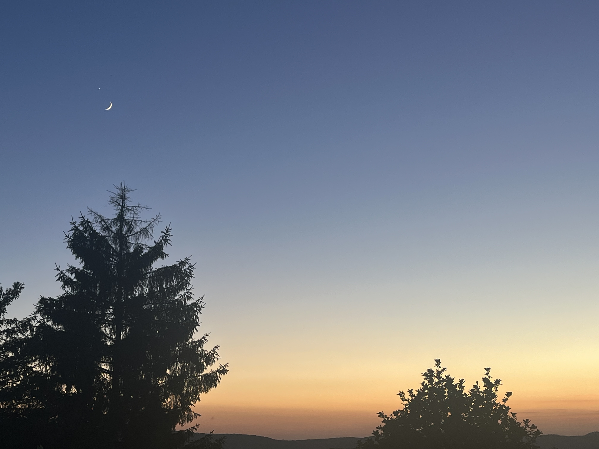

    ---
title: "Turquoise"
date: 2026-06-17
draft: false

---

Clairvaux-les-Lacs, zoals de naam het zegt, ligt aan meren. Aan le grand lac en le petit lac. Hier in de streek liggen overal glaciale meren. Ze zijn ontstaan door de uitslijting van het bewegen van gletsjers. Vandaag gaan we ze van bovenaf bekijken. Ten minste als we op de Pic d'Aigle geraken. Er is beloofd dat je na de beklimming van de Pic d'Aigle en na een stukje verder wandelen zicht krijgt op 4 meren tegelijkertijd. Het wordt vandaag warm, maar we gaan ervoor en ja, hier zie je ons op de top staan met het eerste meer op de achtergrond!

Na een stuk doorwandelen krijgen we zicht op vier meren tegelijkertijd. Goed tellen! Het zijn er wel degelijk vier.

De meren zijn werkelijk prachtig van kleur. Het gaat van azuurblauw tot turquoise. Je voelt je in een tropisch gebied.
Veel Jura-meren worden gevoed door bronnen die door kalksteenlagen zijn gefilterd. Daardoor bevat het water weinig slib en organisch materiaal. Omdat het zo helder is, kan het licht diep doordringen en wordt de blauw-groene kleur extra zichtbaar.

Hoe helder de meren zijn, krijgen we te zien als we enkele halsbrekende toeren uithalen om langs de steile andere kant van de Pic d'Aigle af te sukkelen.

Het was weer een mooie dag en als dessert krijgen we 's avonds op onze slaapplaats nog een prachtige zonsondergang met maan en venus.

