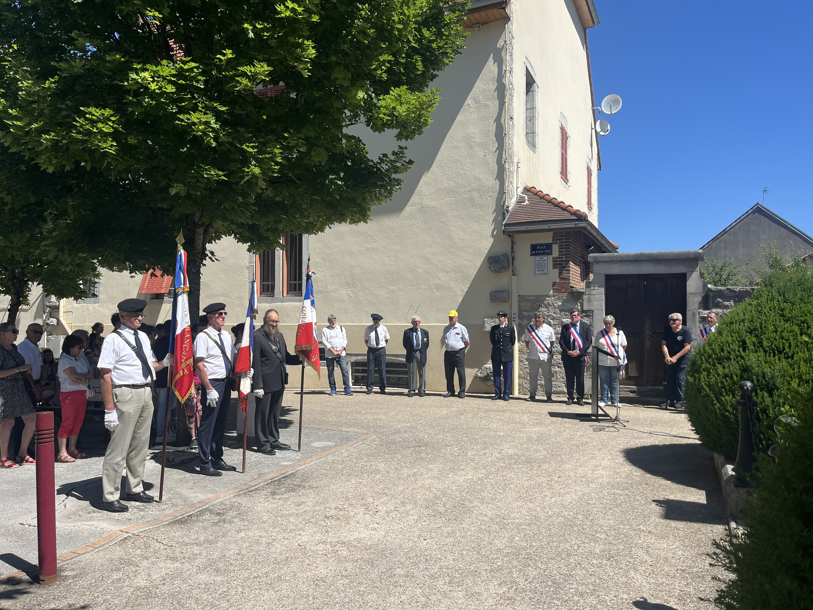
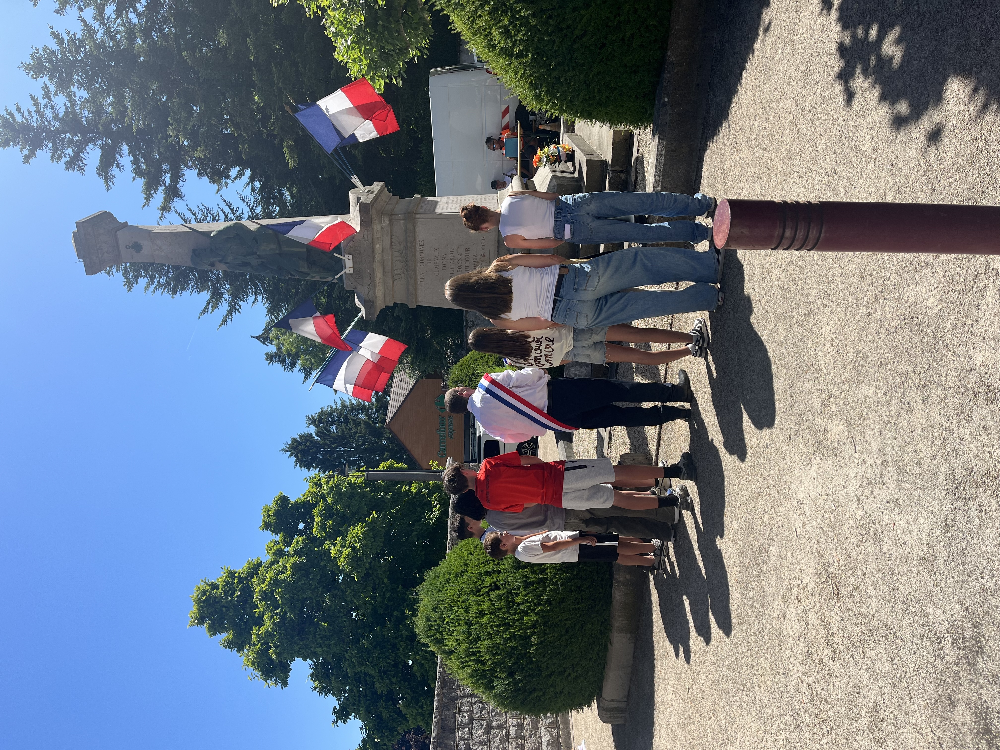
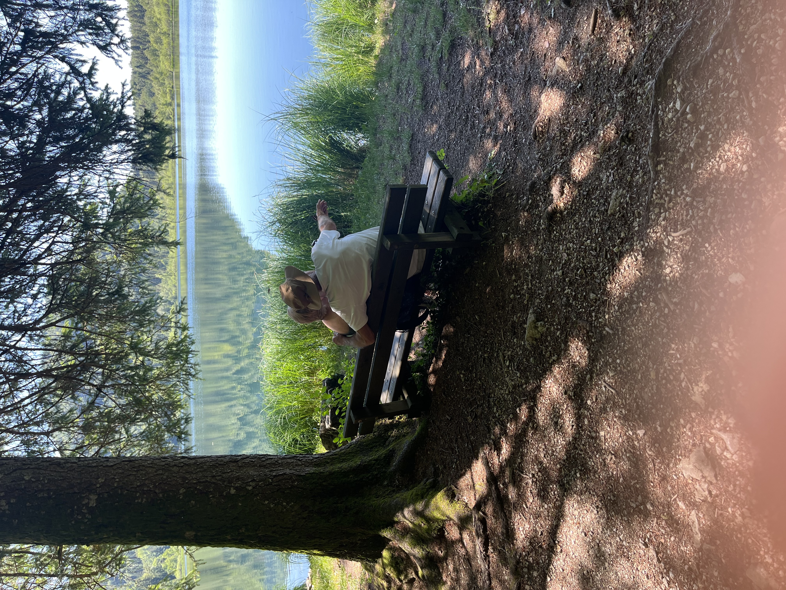
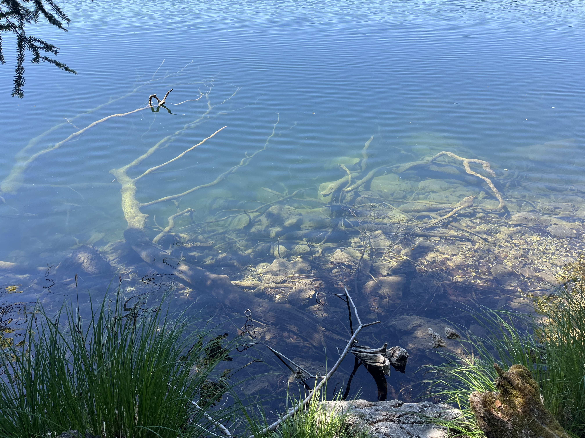
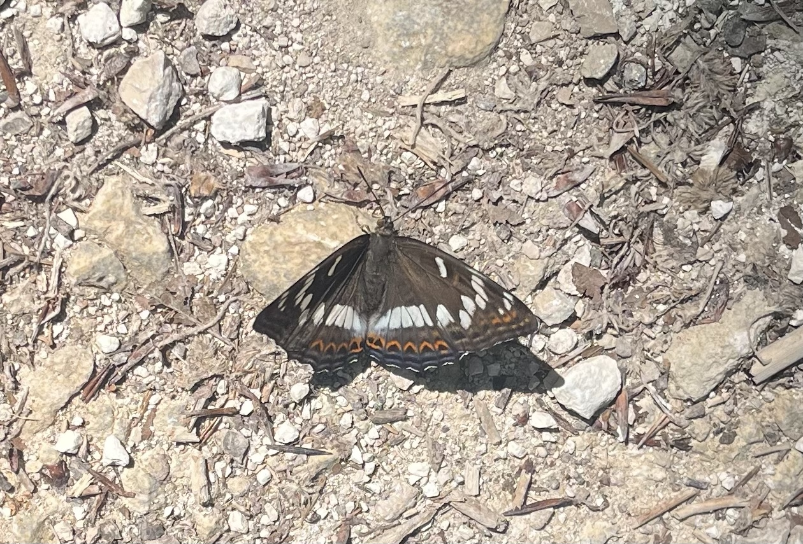

    ---
title: "Vlinderland"
date: 2026-06-18
draft: false

---

Elke morgen nemen we de benenwagen naar beneden naar het centrum om vers brood te kopen. We hadden al een aankondiging zien hangen dat er vandaag een herdenking stond gepland op 'la place du 8 mai 1945'. Niet voor de Tweede Wereldoorlog, maar voor de Eerste Wereldoorlog ter ere van de gesneuvelden in Clairvaux-les-Lacs en de omliggende dorpen. De notabelen van het dorp, o.a. de burgemeester en schepenen, waren aanwezig. 

Er werden enkele teksten voorgelezen en bloemen gelegd door de kinderen van de school. Goed dat kinderen hierin worden betrokken.

Het was gisteren al op het randje voor onze wandeling naar de top van de Pic d'Aigle; vandaag telt de thermometer +30 graden. We zullen ons moeten aanpassen en een iets minder uitdagende wandeling moeten plannen. Minder bergop, bergaf en meer in de schaduw. 20 minuten verder met de auto ligt een klein glaciaal meer. Het is beschermd; er mag niet worden gezwommen. Volgens de uitleg van onze host is het een oase van rust. We kunnen er een vlakke wandeling rond het meer maken, grotendeels in de schaduw. Aan de rand van het meer is een kleine parking en enkele banken. Op de bank zit een ouder koppel; op de man zijn gestrekte arm zit een grote vlinder.

We zien overal vlinders rondvliegen van verschillende formaten en kleuren, maar probeer maar eens eentje op foto vast te leggen! Onderweg valt weer op hoe helder het water van het meer is. Als we ongeveer halverwege onze wandeling rond het meer zijn, is er een grote vlinder die altijd voor ons uitvliegt. Elke keer als de vlinder gaat zitten en we een foto willen nemen, is hij ons te vlug af. Het spelletje duurt bijna 1 km lang.

Totdat... Gelukt! Het is een grote ijsvogelvlinder, eentje die we nog nooit hadden gezien. Kleine ijsvogelvlinders zie je heel soms in Vlaanderen in bosgebied; de grote is sinds 1957 uitgestorven in Vlaanderen.

