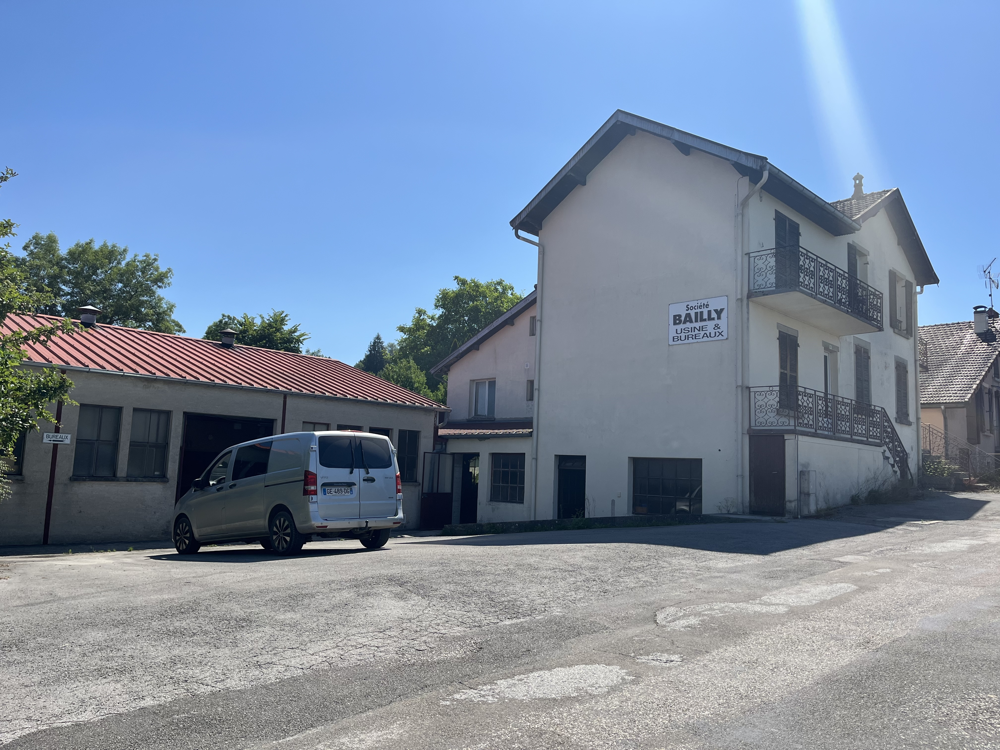
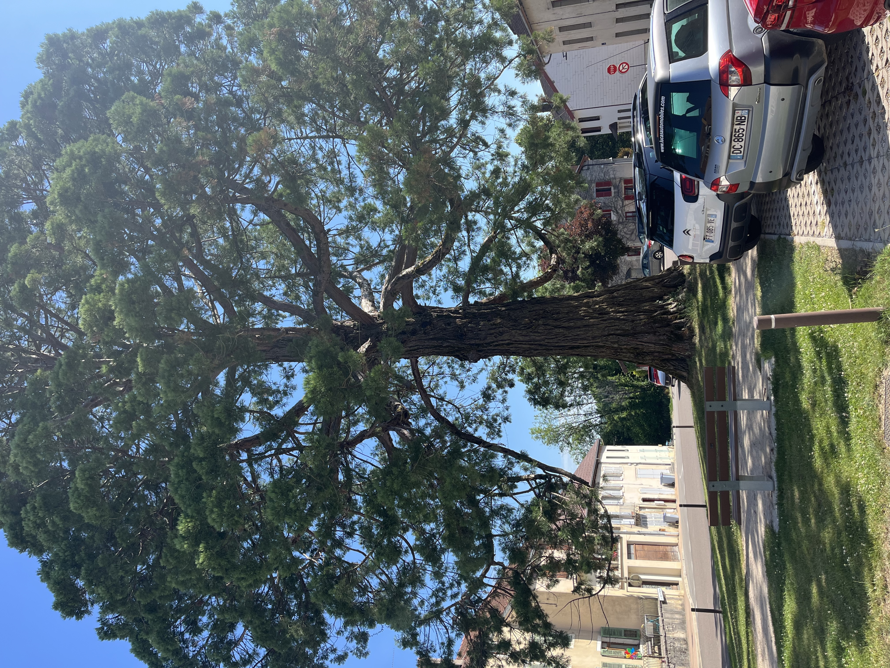
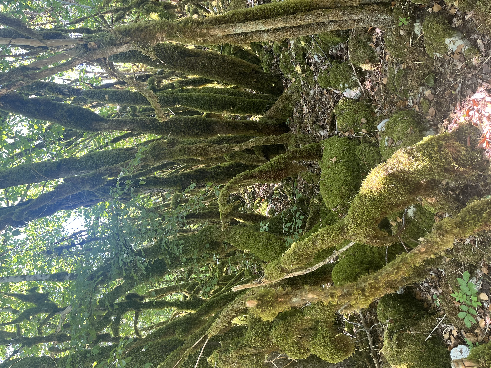
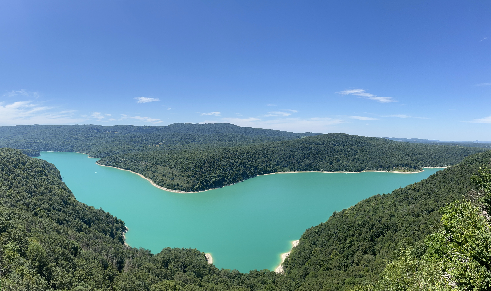
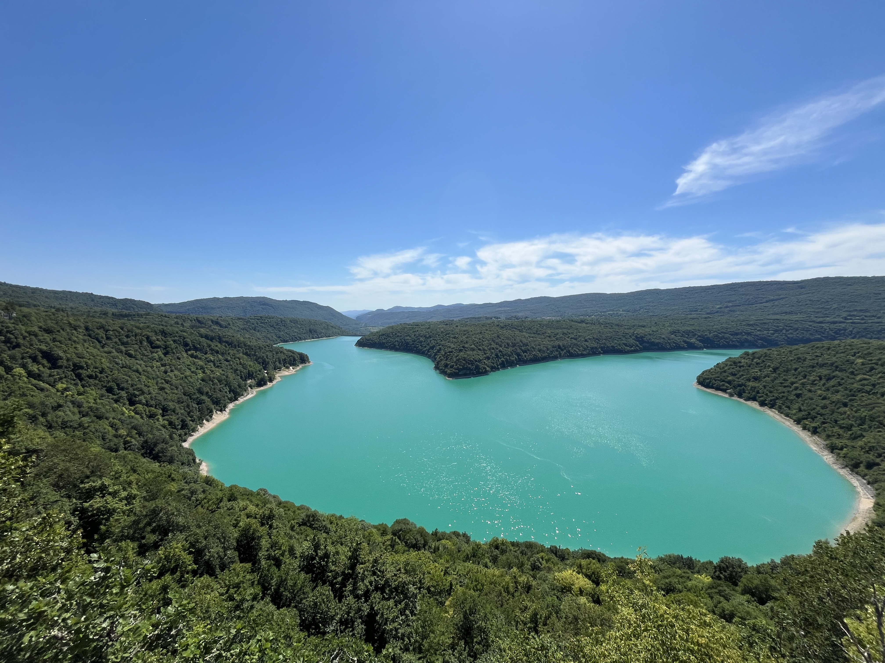

    ---
title: "Houten speelgoed"
date: 2026-06-19
draft: false

---

Als we 's morgens voor brood naar het centrum beneden gaan, passeren we deze 'entreprise' Bailly. Je hoort er altijd wel een machine draaien en af en toe zie je iemand door een open deur aan een werkbank staan. Dat zorgt voor ons voor nieuwsgierigheid, want wat doen ze hier eigenlijk? Na wat opzoekwerk vinden we dat ze sinds 1950 en al voor de derde generatie objecten in hout maken. Dat gaat van keukenmateriaal zoals houten bestek tot medische applicaties zoals houten lepeltjes die de dokter gebruikt om in je keel te kijken. En dat blijkt niet toevallig te zijn. 

 

In de winter, wanneer de landbouw in de bergstreken stil lag, maakten de bewoners in de Jura, die zochten naar extra inkomsten, objecten in hout. Vanaf de 18e en vooral de 19e eeuw groeide dit uit tot een echte industrie. Dorpen zoals Moirans-en-Montagne, dat hier op een half uur rijden ligt, werden bekend om de productie van houten speelgoed. Het gebied kreeg zelfs de bijnaam "de speelgoedhoofdstad van Frankrijk". Er werden onder andere houten dieren, blokken, treinen, poppenmeubels en educatief speelgoed gemaakt.

We bewonderen de mammoetboom in het centrum. Deze is geplant in 1920 en is momenteel 25 meter hoog. De meeste worden in Europa niet hoger dan 30 meter, in tegenstelling tot in Californië, waar ze vandaan komen.

 

Het is vandaag te warm om grote wandelingen te maken, dus we rijden richting Moirans-en-Montagne, waar we een boswandeling gaan maken met 2 uitzichtspunten. We hebben geen idee wat ons te wachten staat, maar beginnen met volle moed aan de wandeling. Gelukkig lopen we het grootste deel onder de bomen en is het nog net draaglijk. Wat opmerkelijk is, is het vele mos op de bomen en stenen. Op sommige plaatsen is alles overgroeid met mos. We hebben altijd horen zeggen dat dit een teken is van gezonde lucht. Dit kan wel kloppen; in de Jura is er weinig industrie, het is hier dunbevolkt en óveral is er bos.

 

Even later komen we aan het eerste uitzichtspunt en dan...

Wauw! Le lac de Vouglans.

 

<video controls width="100%" style="max-width: 720px; margin: 1rem auto; display: block;">
  <source src="film.mp4" type="video/mp4">
  Your browser does not support the video tag.
</video>
 

Wat een privilege om hier te zijn. We zijn tijdens ons 2 uur wandelen niemand tegengekomen.
