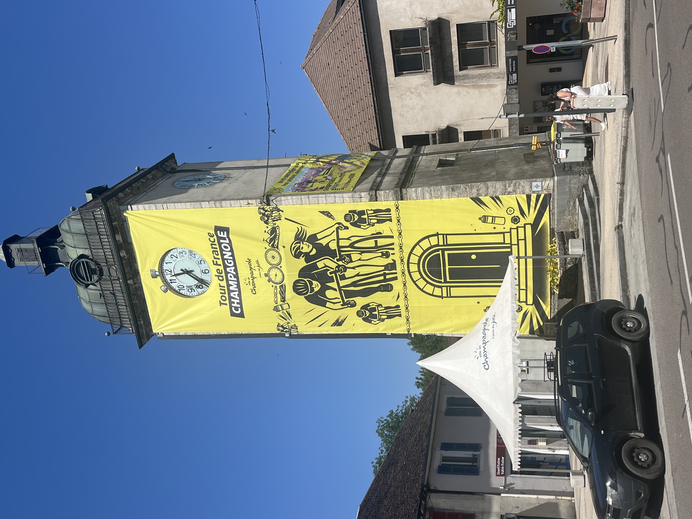
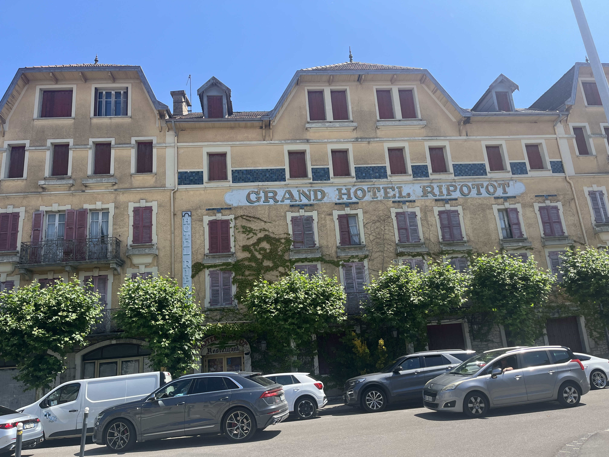
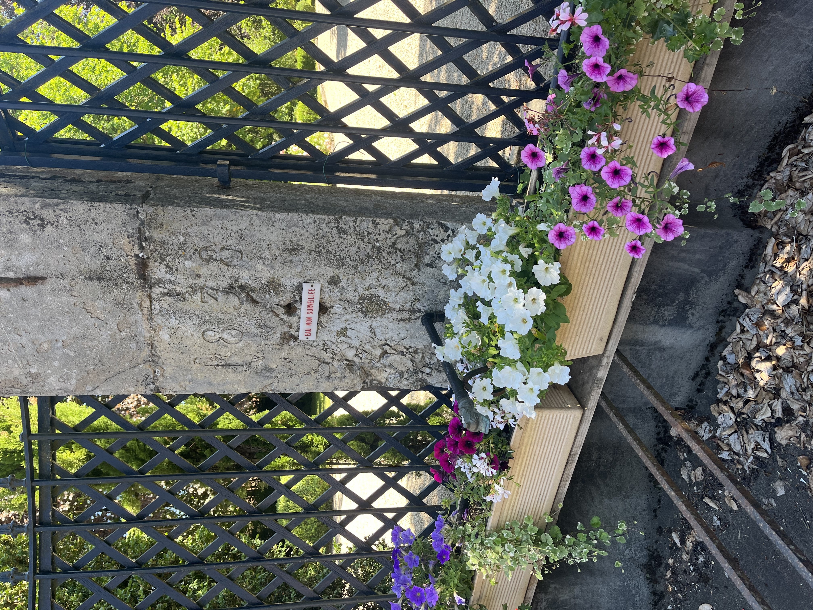
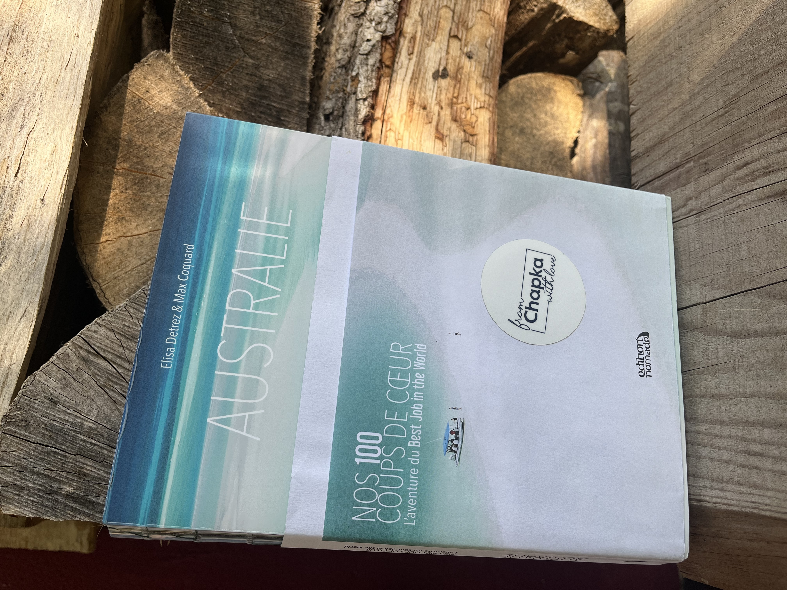

    ---
title: "Park Ranger in Australië"
date: 2026-06-20
draft: false

---

We rijden naar de Marché Hebdomadaire in Champagnole in de hoop om onze voorraad lokale producten (kaas, wijn, honing, confituur) nog wat aan te vullen. Champagnole noemt zichzelf 'le cœur du Jura'. Ze doen in ieder geval hun best, want de 'Tour de France' houdt hier tweemaal halt. Op 19 juli ville de depart voor de mannen, op 3 augustus aankomst in de stad voor de vrouwen.

 

Nu is het er al aanschuiven in de stad. Wat gaat dat worden binnen een maand?

Wat we al die jaren in Frankrijk al zo leuk vinden, zijn al die bronnetjes en fonteinen in de steden en dorpen. Je vindt ze overal in Frankrijk zodra er wat bergen liggen.

Helaas wordt het hier ook steeds droger.

Morgen keren we huiswaarts. We hebben genoten van ons verblijf in de Jura, een mooi, smaakvol ingericht huisje bij Max, Elisa en kindje Lily. Zij zijn de échte globetrotters. Elisa, geboren in de Jura, woonde in 2013 in Parijs samen met haar vriend Max. Ze deed mee aan een wedstrijd om een job als Park Ranger te winnen in Queensland, Australië. Uit de meer dan 300000 deelnemers van over de hele wereld won zij de wedstrijd. Ze mocht 6 maanden en met 100000$ op zak reclame maken voor Australië. Ze overtuigde de organisatie om Max aan te nemen als haar officiële fotograaf. Ze bleven veel langer dan 6 maanden en reisden na Australië over de hele wereld. Ze maakten er hun fulltime job van.

Het boek is echt de moeite om te lezen, maar er is ook een website
<a href="https://www.elisathebestjobintheworld.com/" target="_blank" rel="noopener noreferrer">
  Elisa, Park Ranger, bezoek hier haar blog.
</a>

Op deze blog houden Elisa en Max hun avonturen bij van over de hele wereld. Een bron van inspiratie.
<a href="https://www.bestjobersblog.com/" target="_blank" rel="noopener noreferrer">
  Bezoek hier bestjobersblog Elisa en Max
</a>

